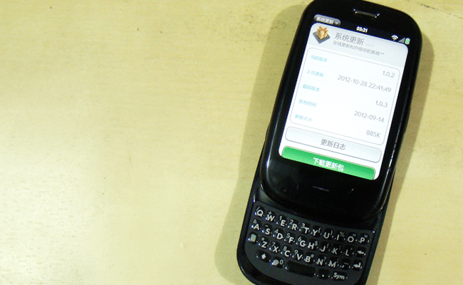
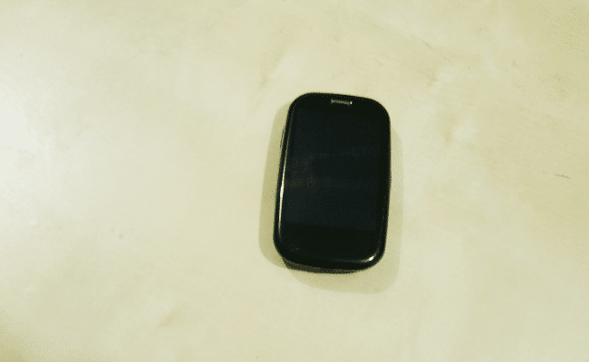
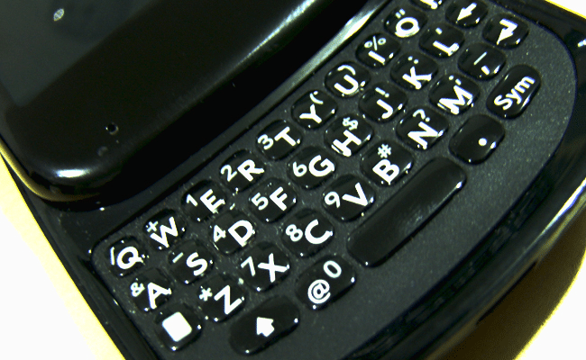

大屏智能手机充斥市场的年代，越来越怀念全键盘手机所给人带来的那种踏实的手感了，也想过收一台9900来用的，但是黑莓那该死的匮乏的应用简直让人想想就蛋疼，之前看过一些安卓的全键盘机（例如me632），外观基本满意，本想入一台的，但是想了想……不能刷android4.0，要来何用！RIM过两天就要发布的搭载BB10系统的Z10，微博上炒的一片火热，可是抛弃了全键盘的黑莓怎么也不能让人提起那种劲儿了。还有一款N系列的机器，虽然有了QWERT键盘，但是少了光学触摸板和拨号键，想一想说用键盘打完字后还要按一下屏幕去选字就觉得有点残念。从抽屉里翻出一台Palm Pre Plus，充上电竟然还能用，不禁开始怀念那些手机瞧在颗粒上咔嚓咔嚓响的日子。

<!--more-->

