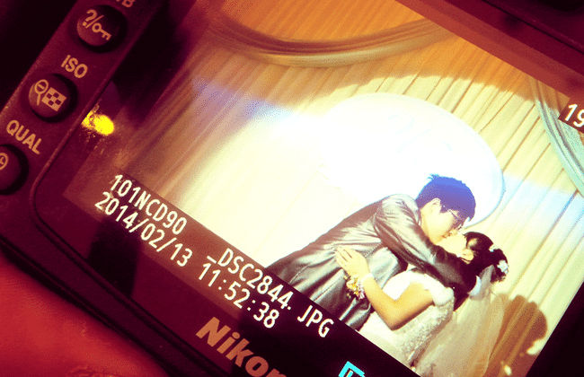

2014年2月12日，我在郑州参加了大学同学翟爷和阿娇的婚礼，我曾在无数的日记中提到过他们，因为似乎我短暂的大学时光就仅存下这几个名字。我对校园的青春记忆仅存留在高中，如果有可能的话，我倒是希望能够多怀念怀念那段在郑州的日子，虽然至今我对郑州都还是好感为零，不知道是郑州影响了我的学校还是我的学校影响了我对郑州的评价……
总之，如果不是因为阿贺和翟爷这几个居住在郑州的好友，那么我可能永远不太会再想主动跟郑州有任何关联。
<!--more-->
翟爷是我的大学室友，栾川人，农村户口，因为我高二时曾经在栾川写生，呆过一个月，所以当他介绍他来自栾川时我顿时就对他有了莫名的好感。现在想想，当时的他是一个很有逼格的文青，喜欢经常泡图书馆，看一些很深奥的书……和电影，例如贾樟柯的《小武》，他经常一个人在宿舍放这让人昏昏欲睡的片子，每次我看到十分钟的时候就睡着了，当我睡醒时发觉他还在看，一边看一边介绍给其他来我们宿舍串门的哥们说你看这片子真好看，那哥们盯着屏幕上DV一般的成像和沉闷的剧情看了一会说，算了算了，这个就算了，哥们你那还有别的片儿吗？穿衣服的不穿衣服的都成。泡图书馆的话他也要看一些心理学和设计学的书，心理学我到现在都看不懂，记得他曾经推荐我看过一本讲《积极心理学》的书，说看完后会提升我的幸福指数，我翻了几页，没觉得幸福指数有毛提升，倒看的我直打哈欠，便换他挑的其他几本设计学的书，没翻几页，就翻出一个裸体女郎来，再换一本，人体摄影，连翻几本，接连如此，这倒是瞬间让我觉得幸福指数提升不少。阿娇是我们班的小姑娘，郑州本地人，是一个极其善良且不计得失的女孩——我觉得这几个词是至今为止我对她最贴切的评价，她人缘很好，跟男孩女孩相处的都不错，我想，哪怕后来她没有跟翟爷在一起，到现在每到我想起我短暂的大学时光时，我应该都会想到她，因为很多年都没有遇到过这种相处起来让人觉得很舒服的女孩了。他们在一起时第一时间并没有告诉我，我是从另外一个好友那儿听来的，当时我已经在北京工作了，朋友告诉我，我说真的假的，他说应该是，我猜的。我一边鄙夷他的八卦一边在QQ上问翟爷的八卦，可是很长时间他都是没有正面回答过我。现在想想，他并不是不想回答，应该只是对自己的未来和对他们的未来都不太有信心吧。后来，某次我回郑州，他俩一起接待了我，也算是对这段关系有了一个交代。
我不太好多说他们之间因为家庭条件的关系而给了翟爷多少的压力和阻力，只是现在每当回想起他们我总能想到那天深夜他哭着给我打来的那个电话，那个因为那天晚上他跟她的家长见面的寒酸的饭局所导致的不愉快和因为被农村户口和城镇户口伤害的男人的尊严，他哭着谴责人生的操蛋和无奈，痛骂自己的赚不到钱的无奈和哭诉饭桌上人家姐姐姐夫事业的各种辉煌的成就所给他带来的刺痛，末了，他哭累了，说，我还是不想放弃，怎么办。
现在想想，我真的很庆幸我当时没有劝他放弃。后来某天，他们领结婚证时我正在为一次工作的变动而焦躁不已，当他在QQ上告诉我这个消息时我也并没有假兮兮的像某些狗血电影里讲的那样“被朋友的欢乐而感染”，我问他说你要怎样面对领证之后的事情的规划和房子车子现实的无奈呢，他的喜悦被我狭隘的个人情感泼了一盆冷水，之后好长时间都再没有跟我有过联系。之后无论是在网上还是现实中，每次见面他跟我永恒的话题都是如何才能够赚到钱，不要很多很多钱，只用够他在郑州买房买车买尊严就行，再不济，哪怕够他办一场风光体面的婚礼都行。在他结婚的前一天，我陪他跟婚庆公司的人一起布置场景，我问他花了多少钱，他说去青岛拍了婚纱照，把父母亲戚从老家接过来订了N多宾馆，请婚庆公司，订酒店等等等等，算了半天他不算了，说好多好多钱，他说这话的时候脸上一半是轻松一半是沉重，完事他说，妈的我本来以为钱够了，现在想想，接下来我还得在郑州买个房呢。做为朋友，我也只是一个正处在创业初期每天要为了几百几千的项目款要跟客户装各种孙子，挂完电话再操他们各种大爷的，永远不知什么时候才能看见希望的人，我帮不上什么忙，唯一能做的就是真诚的祝福他们，他们的这段感情给了我莫大的震撼，他们的故事很平凡，但却远比电影里来的更要精彩和深刻，我想，就跟书上说的一样，我真的希望能跟这样的人成为可以倾谈一生的朋友。