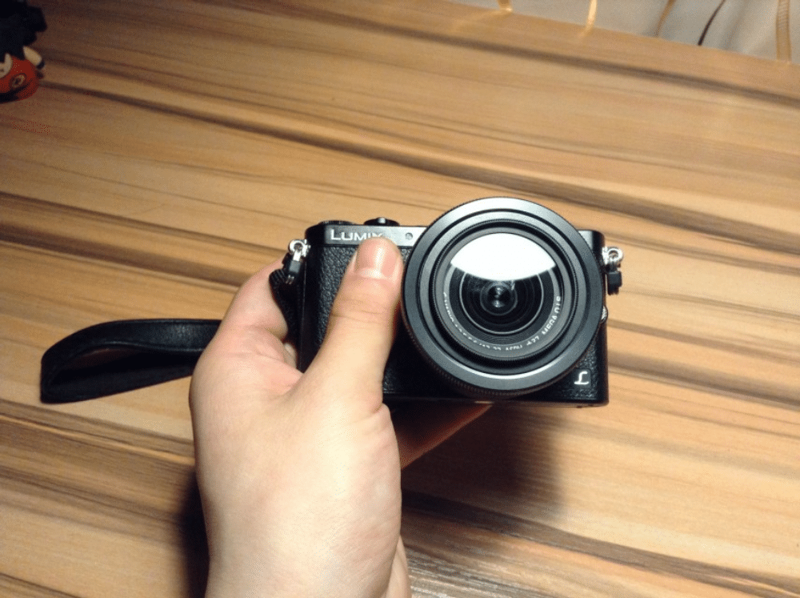

<!--more-->在决定入GM1之前，我在富士的几个机型中犹豫了很久，之前是想入花2000左右的价格入一台富士x20旁轴随便玩玩，选择富士的原因主要还是因为……富士的相机差不多都是以复古造型为主，而我对这造型完全没有抵抗力，做为一个摄影技术般般只是为了日常记录使用的人，我主要还是看重机器的外观和便携性。入了GM1的直接原因还是因为看了春卷老师的[视频评测](http://www.tudou.com/programs/view/fJ62cCnRw5g/)，虽然人都说pchome枪比较多，但是个人感觉春卷老师的相机评测做的还算是比较真诚的。玩了几天，简单的说下感受。
<!--more-->### 携带感受体积确实很小，很轻，相当于拿了一罐可乐的重量。单手掌握没问题，完全不用挂绳。日常出门的时候收起镜头直接塞在外套口袋里就成，毫无存在感。尺寸嘛，大概就跟一个烟盒差不多大小。### 镜头搭配镜头使用的是M43镜头，可选的镜头非常多，详见《[**M43系统镜头列表**](http://www.four-thirds.org/cn/microft/lense.html)》。机身标配的是个**12-32mm F3.5-5.6饼干变焦镜头**，使用感受还行，主要感觉就是小，但是镜头没有变焦环，我又不习惯机身自带的触摸对焦，所以接下来打算入一颗[**奥林巴斯**** 45mm f1.8**](http://detail.tmall.com/item.htm?spm=a1z0k.6846101.1130973605.d4915205.XHjTli&amp;id=12919196218&amp;_u=iglptie2f04)**的镜头用来拍静物。**推荐阅读：《[一淘玩客：镜头选购指南](http://wanke.etao.com/product/600000000008126.html?spm=a230r.1.15.3.uG5V3U&amp;tbpm=20140318)》
### 缺点因为我对相机没什么过高要求，所以几天的使用下来，觉得机器的最大问题就是待机时间短，电池竟然只有600毫安时，网上说待机300张，我没有具体计算过，反正感觉连续使用的话两三个小时撑死。更让人不爽的是机器这机器不能连USB充电，也不能直充，也就是说只能用座充充电（厉总的NEX5竟然还可以使用移动电源充电）。机器的接口使用miniUSB，不是现在常见的microUSB口，所以如果要拷照片到电脑里还必须要额外的再携带一根线（所以我现在只用读卡器）。然后就是连接WIFI的过程比较烦碎，传输速度慢，不稳定，原没有网上评测里说的那么顺畅（理想场景是边按快门拍摄边WIFI传送到电脑），因为使用来实在不是很方便，又极其耗电，所以这功能基本上成了鸡肋。### 总结及其他相机推荐总结下来的话这机器基本上还是符合我个人便于携带的需求，但现在4300+的价格实在是太贵，性价比不高，感觉如果在3200上下是比较合适的。

