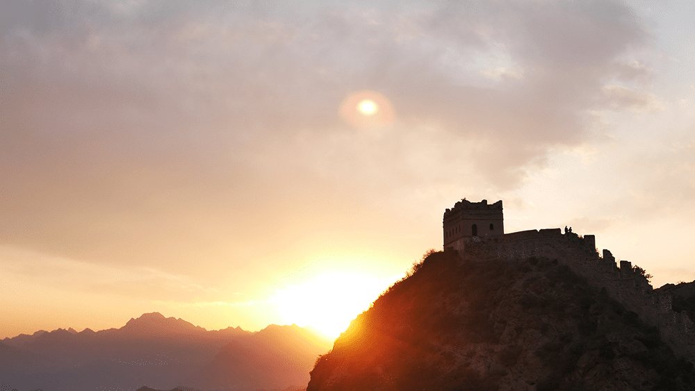
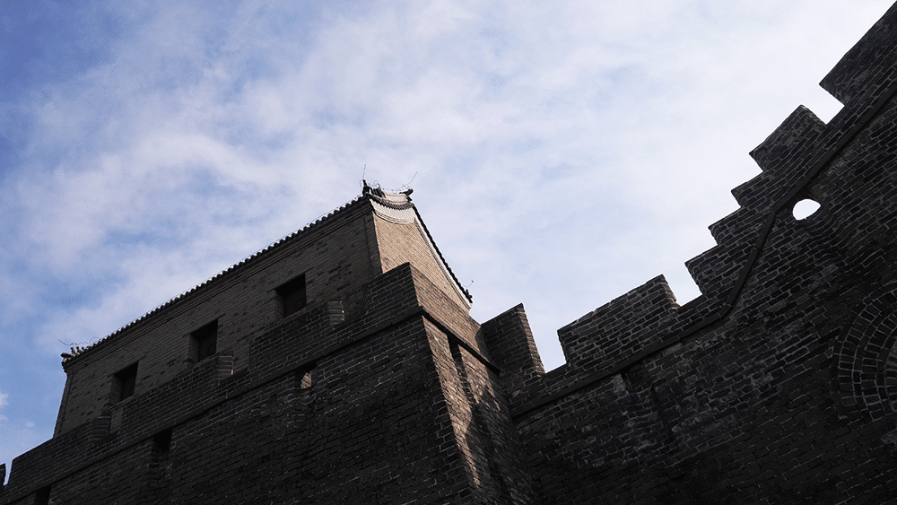
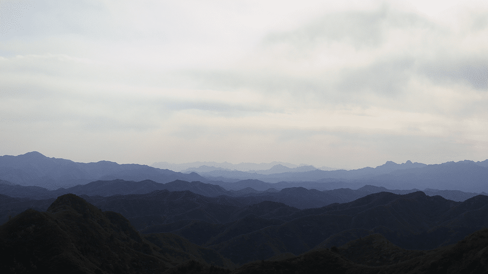
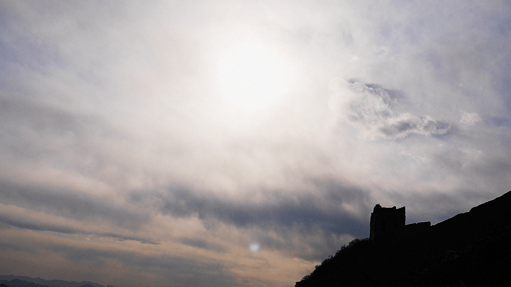
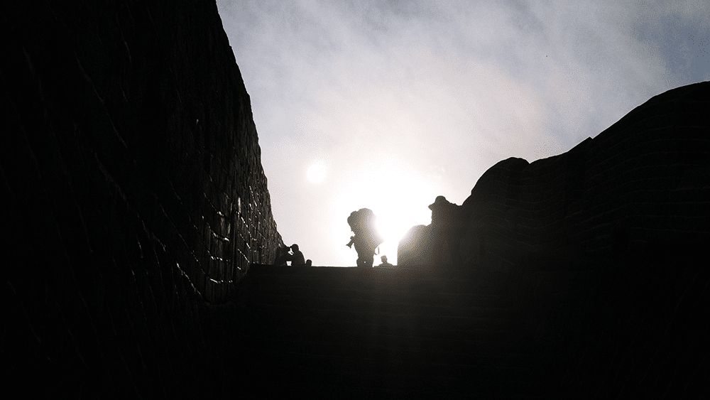

5月份跟厉向晨一起爬了趟金山岭长城，其实也是他考到驾照（C2）后的一次练车，从北京开到了河北，我发现厉总开车有个好习惯，就是不骂人，不像我很多其他朋友，平时还好，但是一开车就骂人，骂行人不会走路，骂其他司机不会开车，骂马路设计不合理，好像全世界就他会开车一样。当然，我后来想了想，也可能是因为厉总手生，还不敢太嚣张的关系，希望他以后也能做一个有车德的好司机。

<!--more-->

