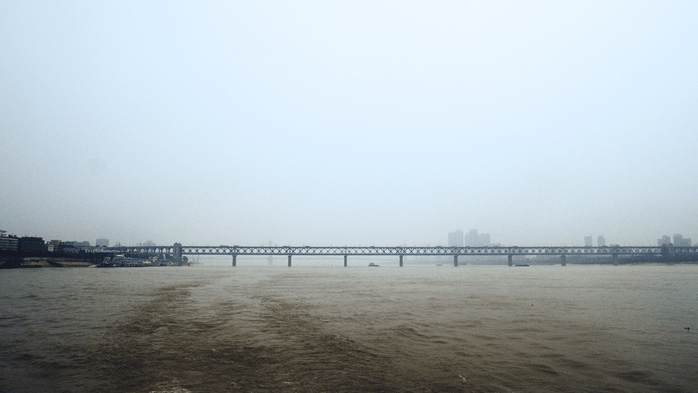
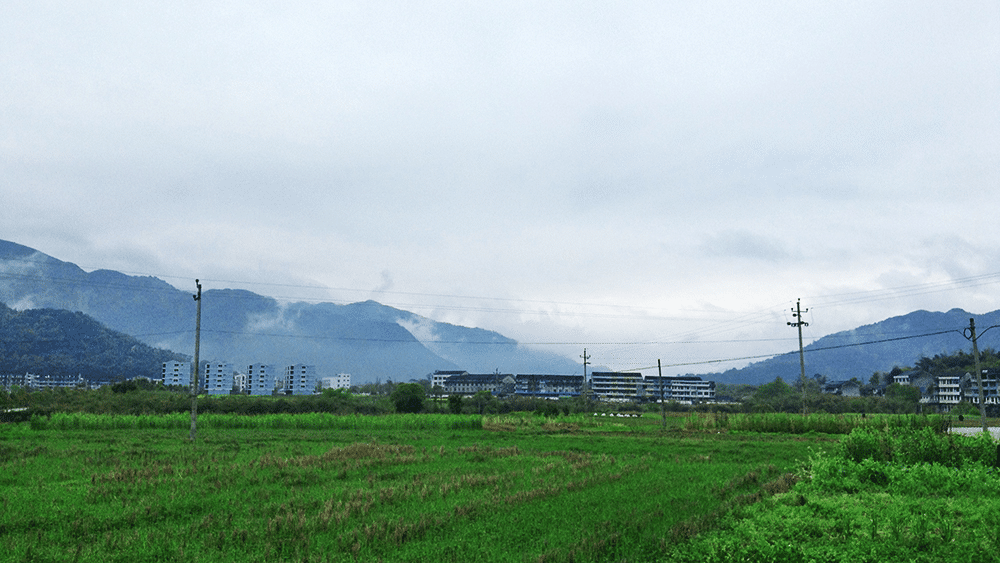
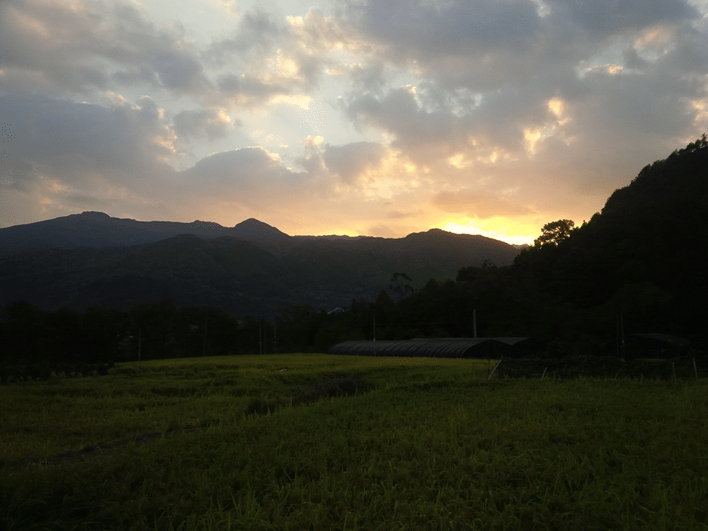
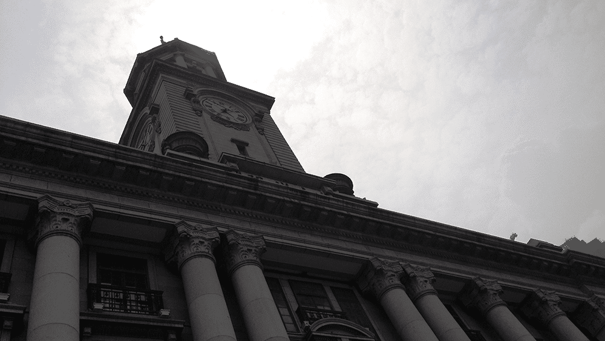
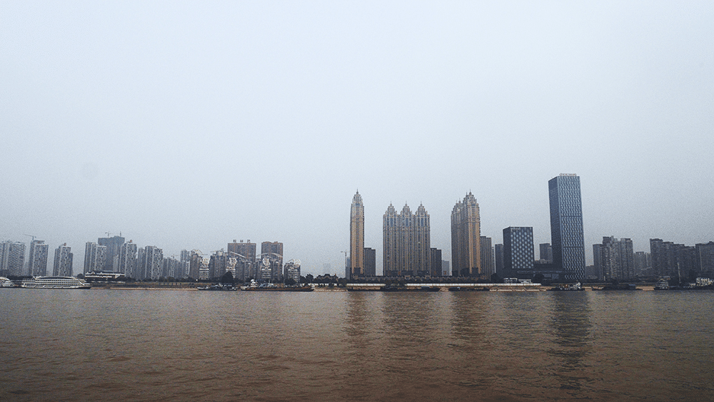
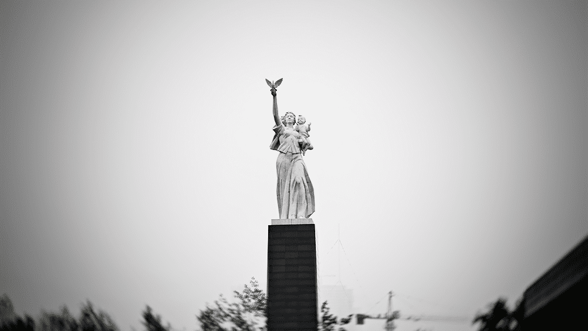
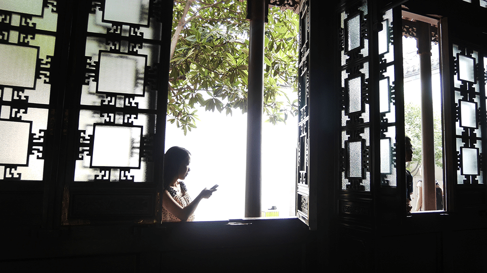
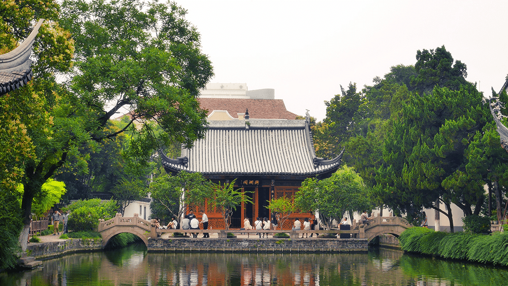
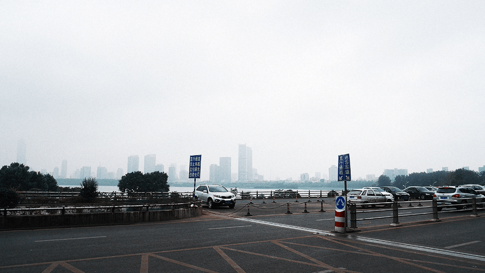
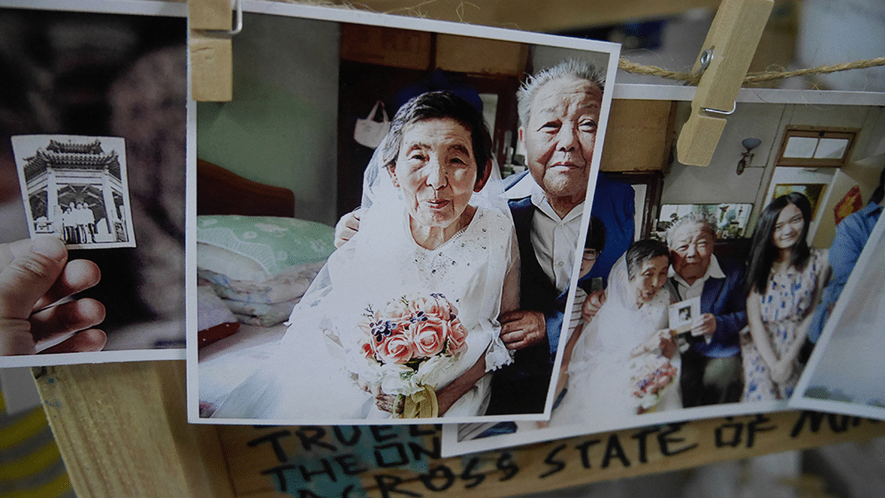

跟很多生活在小城市里的人一样，18岁以前我几乎哪里都没有去过，08年还是09年，那时候在郑州混着，有天遇到一个高中朋友，在南昌上学，说走去我学校玩吧，想着说自己长这么大了，还没有出过河南省，太无趣了。于是我就买了票跟他走（这也是我人生的第一场说走就走的旅行），硬座，我们晚上6点上车，一直坐到第二天下午，早上天蒙蒙亮的时候我昏昏沉沉的在硬座揉我坐了一晚上的硬邦邦的屁股，这时车停在一个小站，窗外飘着小雨，站台上一个瘦弱的南方姑娘撑着伞等车，再远处是大片大片梯田，天是阴的，地是湿的，这就是我对南方城市的第一印象。工作后渐渐去了不少地方，但每次都只是匆匆驻足，真想有机会能好好找个地儿呆上一阵。

武汉长江大桥13年从温州机场开车到瑞安的平阳坑镇东源村，也算是人生的第一次自驾游，那是一个看起来与世隔绝的村子，没有快递，没有互联网，仅有一个旅馆（如果那一天40的屋子能够算是旅馆的话）和一天一趟的大巴车，村里人完整的掌握了800年前木活字印刷的传统技艺，并以这门技术给人印制家谱为生。

温州瑞安平阳坑镇东源村
<!--more-->

瑞安某个小镇的黄昏14年的夏天又去了一次瑞安，这次沿着地图一直开到了某个海岛上，住在海岛上的一个旅馆，旅馆老板娘是福建人，嫁到了浙江，看到我们租的车是闽牌照，以为是老乡，非常热情的跟我们聊天，说嫁到了这边后就好多年没有回过家了，丈夫去了北方打工，而她只能每天坐在门口看着海无所事事。吃过晚饭后，她告诉我们说明天早上我们可以早一点起床，开车去海边看日出，然后可以回来吃早餐。于是第二天我们很早就收拾东西起床，沿着海岸线走了一大圈，回去的时候因为赶时间就没有回旅馆，开车从她门前经过时看到她一如既往的坐在门口看海。

