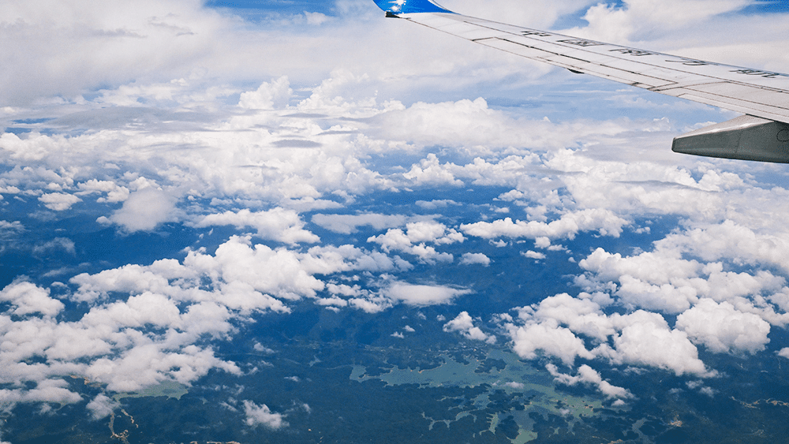
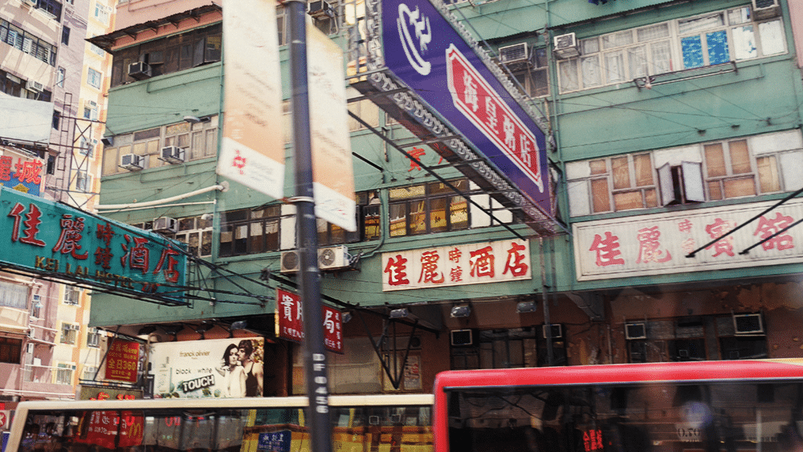7月初的时候因为工作的关系去了一趟香港，说来惭愧，这是人生的第一次出境游，动身前还查了很多的旅游攻略，并找朋友要了一些攻略，在深圳出关的时候换了3000的港币，不过因为一直刷卡，导致回来时身上竟然还有1000多没有花出去。
<!--more-->
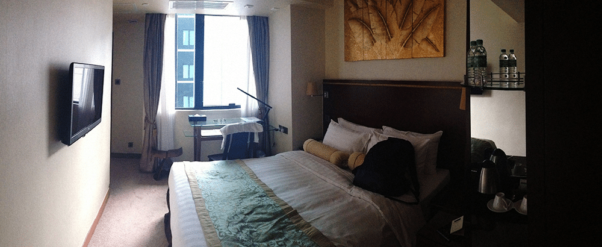
旺角酒店，平日700一晚，周六日1100，实在是太贵了。对香港印象最深的还是密集的楼宇，确实是寸土寸金，酒店一般都是500港币起，还都是得预订，节假日价格更高，一开始住在香港客户给定的旺角的某酒店，位置确实是很好，晚上很热闹，走半小时可以到维多利亚港，沿街都很繁华，各种商城，但是很贵，每天760，周六日1100，忍痛住了一天，第二天通过携程定了一家一天500的，环境也差不多，就是稍微有点远，在奥运，不过那条街茶餐厅很多，早上起来可以感受到香港普通上班族的生活。偶遇另一位来自深圳的朋友，他说他住在旺仔的某个家庭旅馆，一天200……实在是不敢想那是怎样的一种环境。
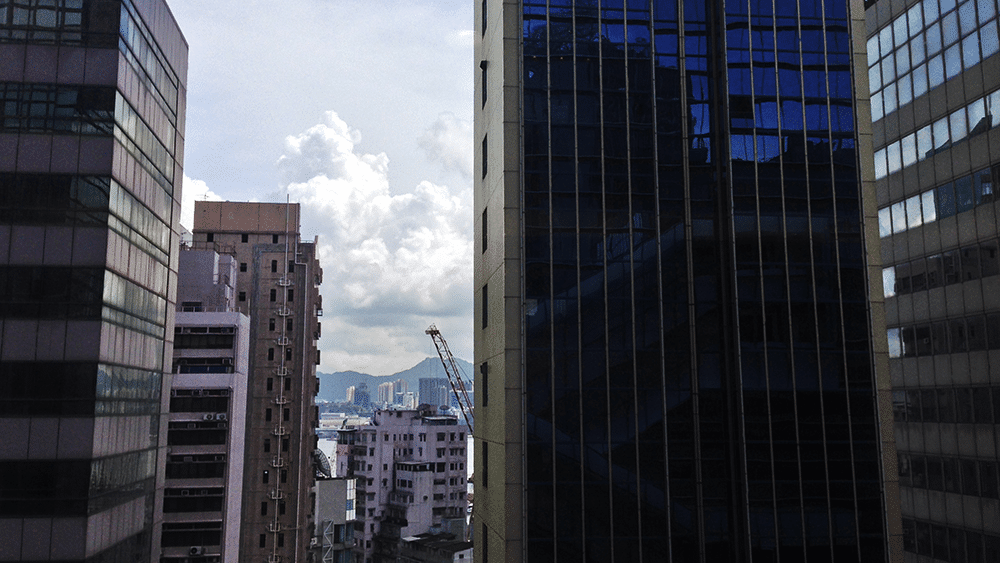之前就说过不太习惯南方的湿热环境，这种感受在香港更为强烈，每天都是闷闷的，没有空调简直就没法活下去，不过就这样香港的上班族们确实依然是西装革履，确实很佩服他们的职业素养……看的我都替他们热。
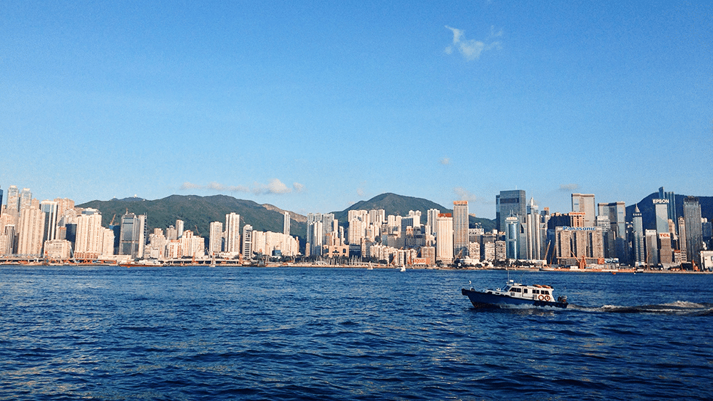坐了一下各大旅游攻略上都提到的天星小轮，感觉到是没什么特别的，不过确实是可以饱览维多利亚港繁华的夜景，但是要排很长的队，票也比较难买。在船上时跟朋友聊起来了兰桂坊，他用蹩脚的普通话问我有没有看过《喜爱夜蒲》，我问他你说的是一还是二？他一听，露出了心知肚明的微笑……他说有空了带我去逍遥的，不过似乎我们后来都忘记了这档子事。

iPhone5摄于天星小轮上，夜景的噪点太多了
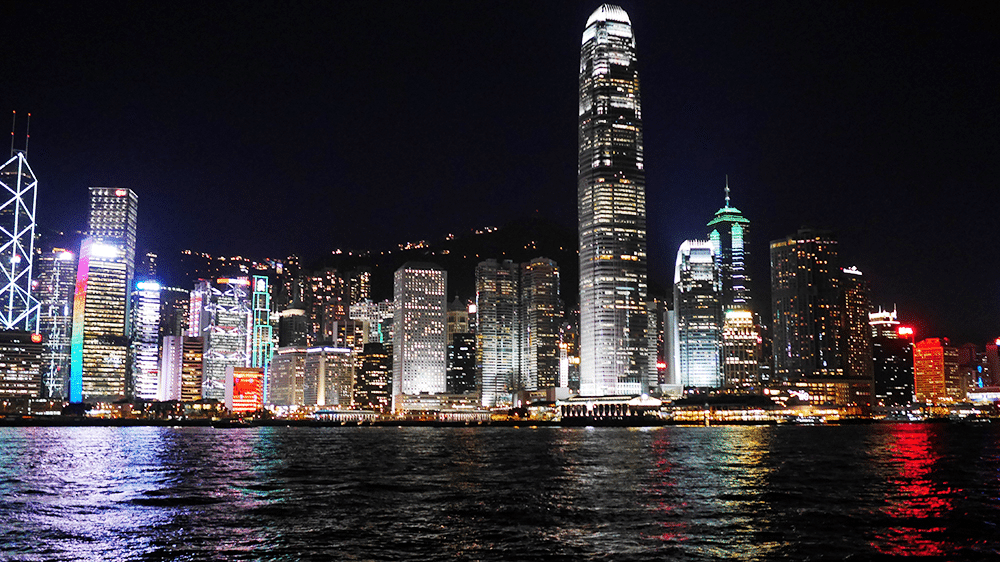
松下 GM1摄于天星小轮交通的话，真心不太能够看懂香港的公交线路，坐过几次，依然迷迷糊糊的，后来就纯粹改坐地铁了，话说从罗湖到上水那一站，一下子就花掉了快30块钱的八达通，真心感觉太贵了。并且一开始不知道，误入了东铁线的头等舱，看了下，感觉不太对劲，后来问了朋友才知道，香港地铁一开始是两家公司运营，东铁线其实算是火车，两家公司合并时作为历史的一部分而保留了下来。
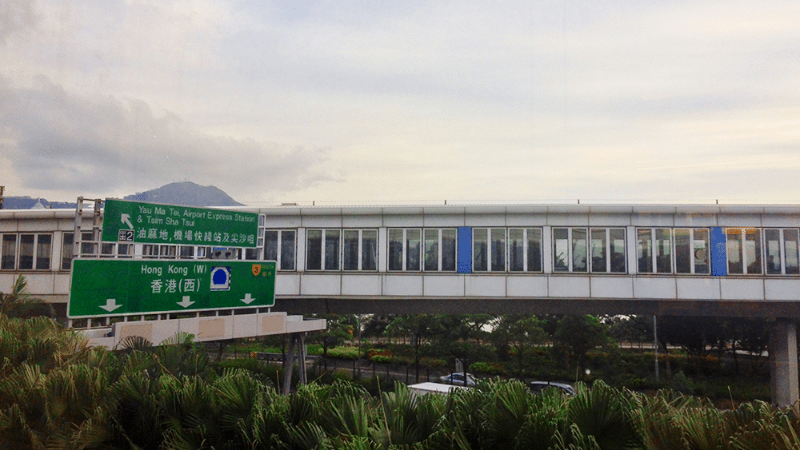印象最深的还是中环，高楼林立，街道整洁，繁华但又宁静，朋友在微信中说，希望以后我们能把公司开在这样的地方，我表示赞同。
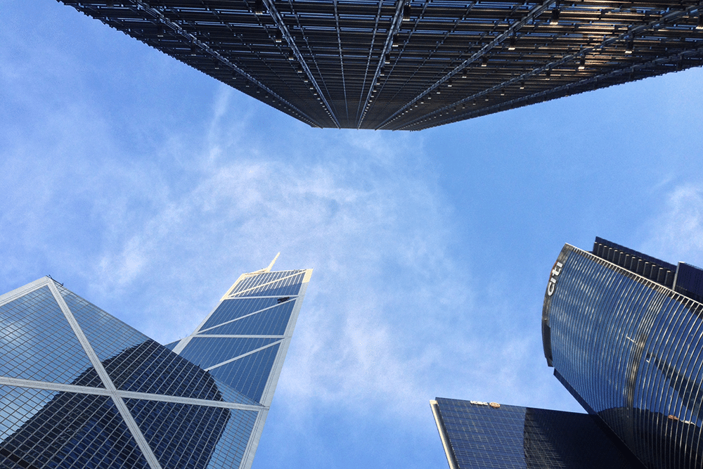
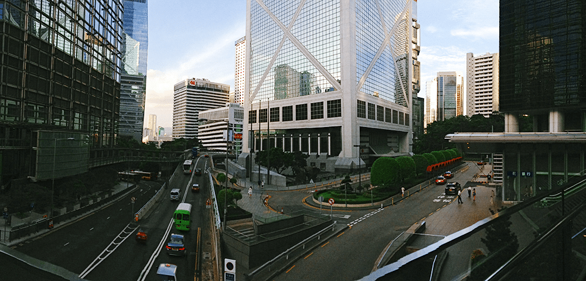
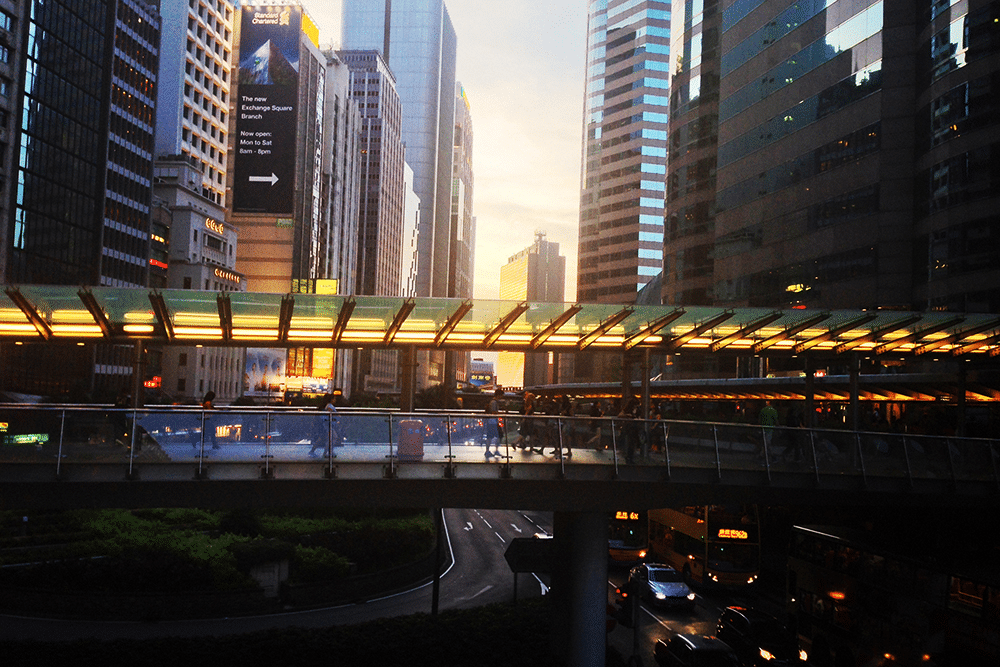
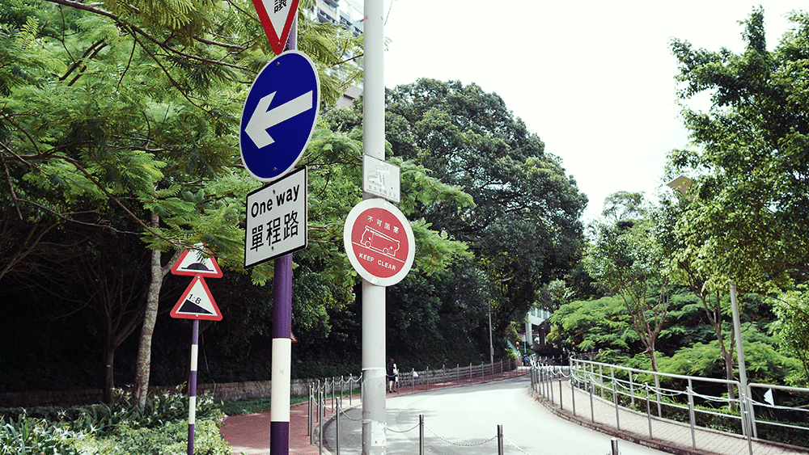

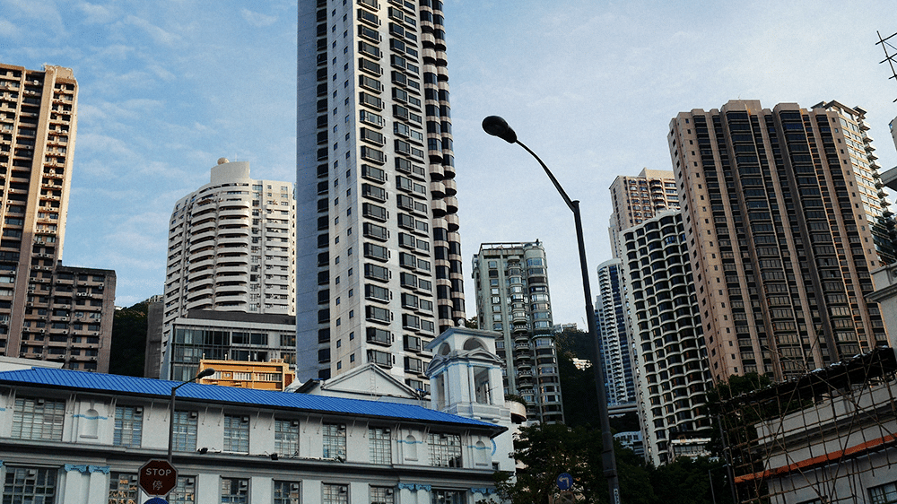
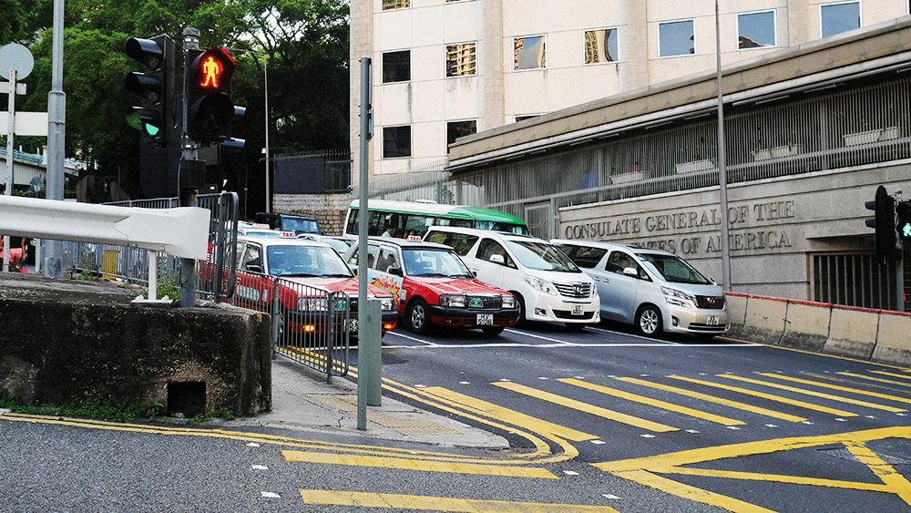
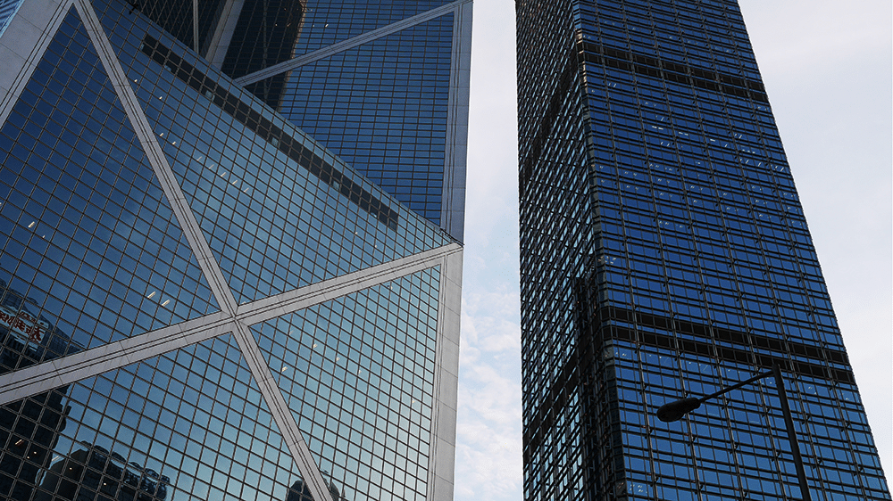