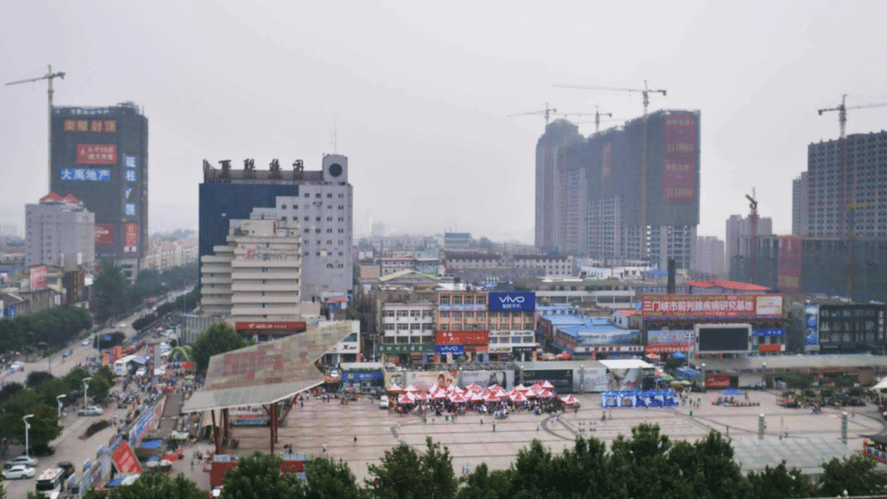
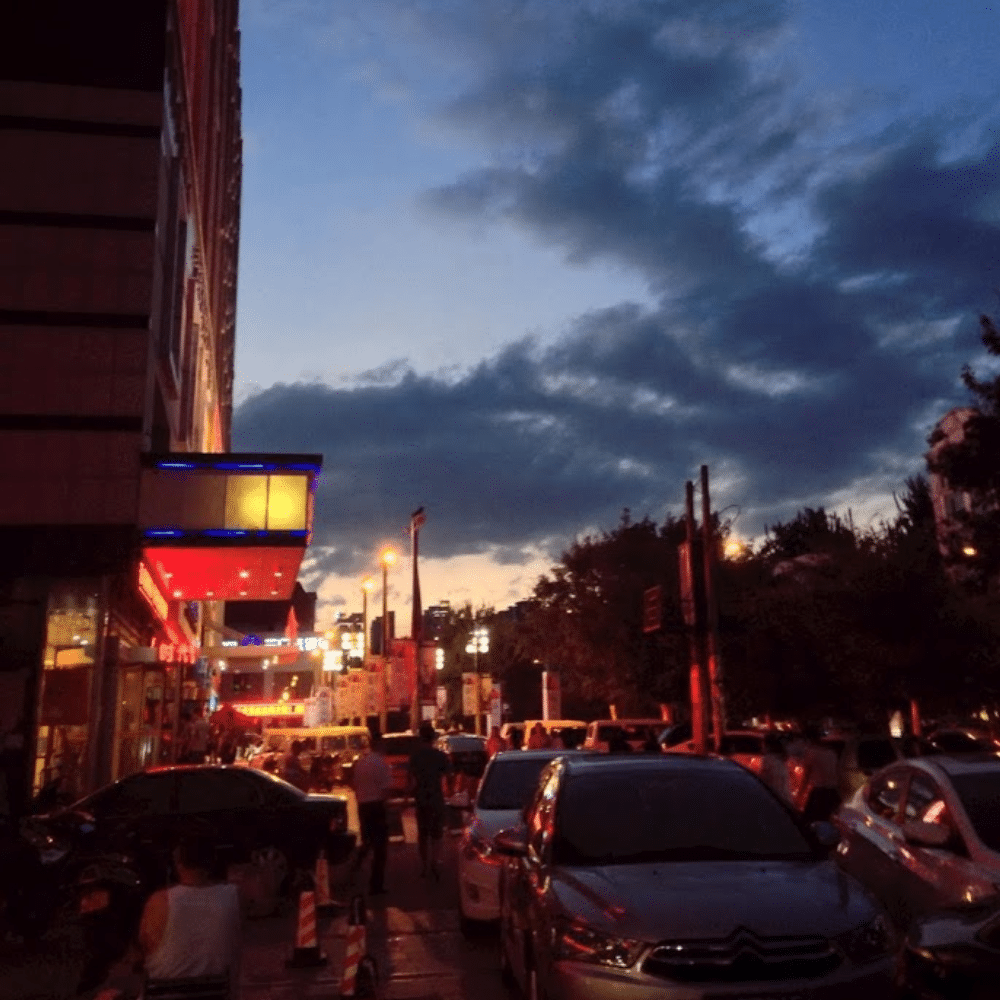
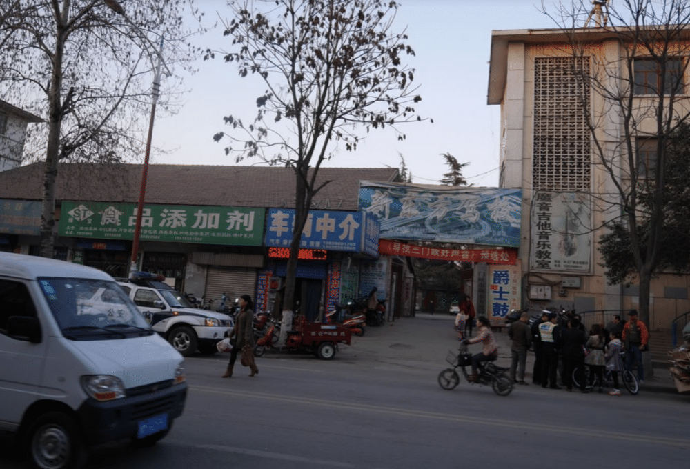
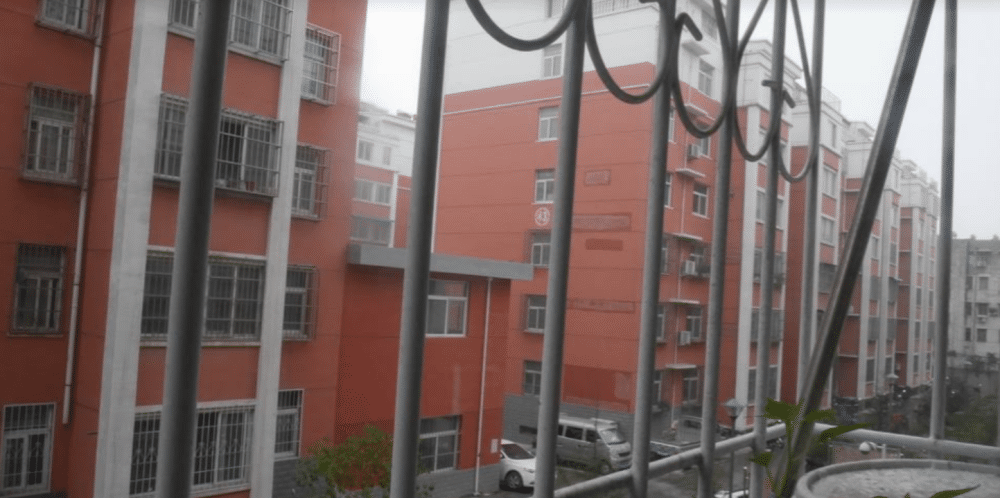

在北京呆了四五年，工作时主要做产品设计及前端开发方向，标准的 IT 从业者。
2013 年回老家创业，跟朋友一起做了个小广告公司，以接北上广的 IT 外包项目为生。老家是河南小城，三四线城市，生活和创业成本都很低，租了个 40 平的房子办公，每月房租 1200（之前是每个月 800，不过地段不太好 ），不含人力，算了下每年成本大概在 2W 左右……
这点钱要是想在北京开公司肯定是不可能的。
<!--more-->
从家到公司走路上班需要15分钟左右，骑车就5分钟吧，不过还是觉得很远，但某次在地图上量了下，发现这个距离其实只相当于在北京时从住处到地铁站的距离。
在家里时，感受最深的变化是生活规律了，工作早十晚四，每周双休，偶尔加班，下班之后走 5 分钟到健身房，锻炼后再走 15 分钟回家，一般到家时父母都做好饭了，吃完饭陪他们看上两三个小时电视就睡觉。偶尔朋友约出来玩，出门打个车 10 分钟左右就到，基本上无论做什么都毫无「距离感」，从来不担心晚上太晚了赶不上末班车回家，生活非常简单轻松。相比起来，在北京时，早上7点起床，洗漱完挤公交换地铁到公司 9 点左右，上上网看看新闻磨叽一会就午饭了，一般下午才进入工作状态，一忙起来常常就忘了时间，而且大部分公司加班成性，晚上 8 点下班都跟做贼一样，正常时间到家一般都在晚上 10 点左右了，拖拖拉拉到一两点睡觉，基本上一天也干不了别的事了，每天都过的很匆忙。收入的话，家里的同学朋友多是在企事业单位上班，工资 1200 - 2500 左右，大部分都是家里备好了房和车，所以这个数字过日子是完全没什么问题，不过基本上大家都没什么存款（家里条件特别好的除外）。反观北京，应届生差不多起薪都在 4000 往上了（只说互联网公司，别的行业不了解），有个三五年经验的话多跳几次槽基本上税前都能在 8000 - 1W 左右，但这个收入负担完房租水电什么再加上杂七杂八的消费，存钱似乎也很难。虽然北京跟家里的收入相差很大，但除了房价外，个人感觉其他消费基本上没啥区别，只是小城市相当选择少一点，消费不够便捷。例如看电影，家里就一两个电影院，排期倒是全国同步，票价 30 左右，3D 的 50 ，没有 iMax，也不能网上选坐。可以逛的地方就那么两三条街，吃饭的地儿到是比较多，但常去的就几家，朋友聚餐人均 50 - 100 左右， KTV 里一瓶罐装啤酒 30 块简直就是在抢钱，买衣服的话地淘宝质量的地摊货均价 100 左右，专卖店五百一千一件衣服很正常（所以上次一女性朋友说她拿了一个月工资买了一条 1500 的裙子我还是惊诧了很久…）。
北京就不用讲了，选择极其多样性（市场竞争也比较惨烈，微信 19 块电影票什么的，再加上团购，有时候甚至会觉得比家里还便宜…），消费极其便捷现代化，水电费啥的都能网上交，甚至自从物美支付宝钱包扫码付款 9 折后我逛超市连钱包都不带了…但也因此花钱的频率极高，钱包不知不觉就空了。讲到我个人，因为是做 IT 的，又有点行业资源，经验和人脉积累也算较充足，所以经常能接到一些外包的小项目，均单价在五千到两万之间（再大的项目就不是一两个人能做的了，也得转包给其他公司），对于一个基础生活成本较低的小城市来讲，隔三差五的来点这种项目，收入基本还算满意，但我依然不太能够接受经常一两千块钱买双鞋子衣服什么的做法……不过最近我又回到北京了，跟一个朋友在做一个创业项目，这几个月明显就感觉到了「紧迫感」，以前在家里的话，客户结一次帐感觉可以撑很长时间，偶尔还能存下点钱。而现在……上周刚结完帐这周看着银行卡就开始困惑钱都花在哪去了。哦，还有一点就是家里的快递除了顺丰，基本上都不上楼，只能下楼自取。忍不住要表扬下顺丰，真心好，服务标准全国统一，送件到户，上门取货，态度也极好，巴枪人手必备，扫码支付啥的统统不在话下，以至于我经常在公司跟快递员打交道时有种「人在北京」的错觉。
最后，我觉得，如果已经北漂了（或者去其他城市），那就好好利用起来在这里的匆忙时光（说白了大家都明白要想留在北京并「活的很好」有时候来讲是「不太现实」的），毕竟北上广相对其他地方，能够接触的资源当然会更广一些，所以多留意收集这些资源，以后回家创业或者工作都是绝对有帮助的……当然，其实这话本身就是废话，毕竟只要你生活在世界的任何一个地方，都要有可以谋生的一技之长。