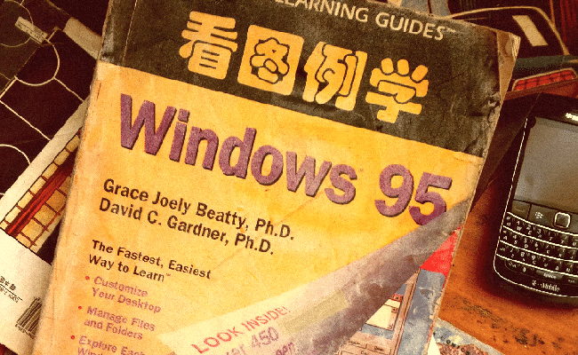
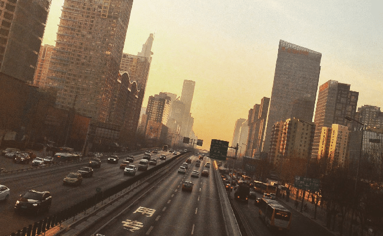
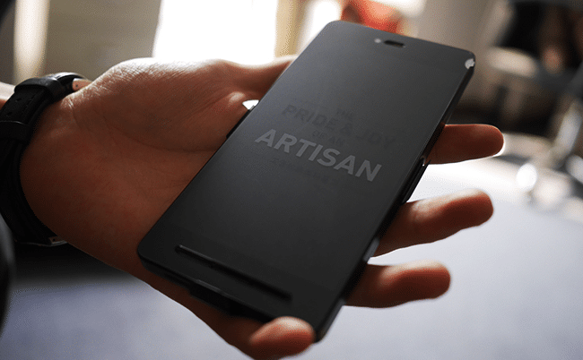
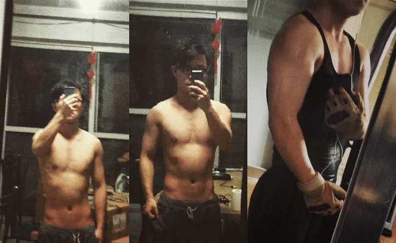
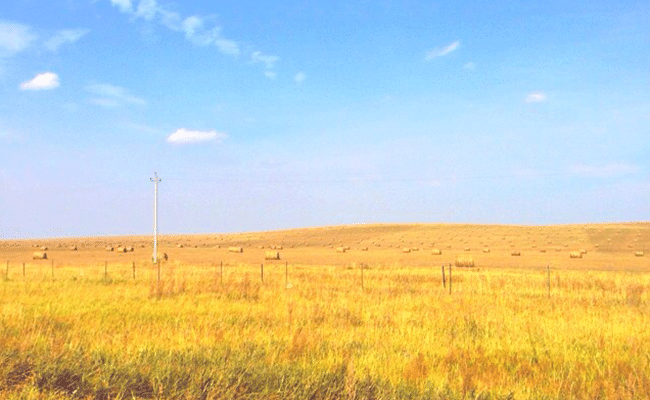
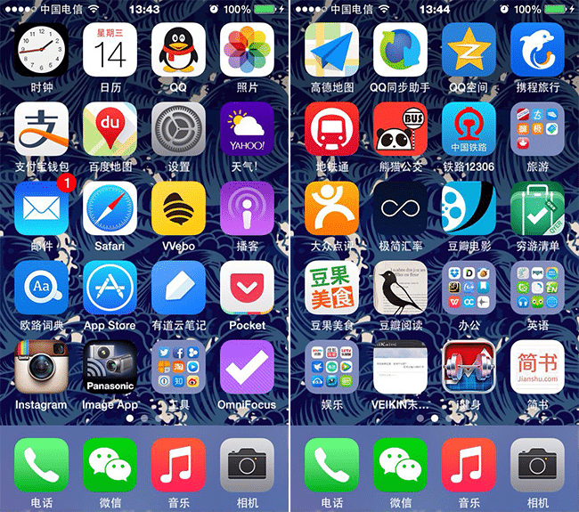

新的一年已经过去大半个月了才想起来回顾下2014，因为老觉得看完阴历年春晚才是一年更迭的标志。忙里偷闲的回顾了下匆匆忙忙过去的这一年都做了些什么。

2014年第一张照片

2014年最后一张照片
<!--more-->
拍过 1050 张照片（实际上肯定更多，iPhoto 上留下的有价值的就这些），第一张照片是《看图例学WIN95》，是在家里搬家后在老房子里拍的，在那老房子里住了十几年，住习惯了，以至于有很长时间我在公司下了班之后都是先回老房子里呆一个多小时再回新家。最后一张照片是从红杉资本出来后站在大望路桥上拍的。 大多照片是用 iPhone5 拍的，作为便携的多功能随身必备物品，优质的摄影体验，找不到比它更值得入手的手机了。
部分照片是用 松下GM1 拍的，搭配奥林巴斯 17mm / f1.8 定焦头，明年打算换一个更小点的饼干头。
-
共看过 102 部电影（以豆瓣记录为准），最喜欢的是《星际穿越》，打算近期找个时间再看一遍。除此以外看过最多的电影依然是《大话西游》，今年又看了两遍。《后会无期》也不错，另外比较喜欢的两部没有节操的片子：《火山对对碰》和《爸爸的好儿子》。年度烂片是《一步之遥》，不解释了，每次一想到这个电影就胃里各种反酸水。最喜欢的单曲分别是林宥嘉的《大象舞台》，赵露《慢慢慢慢》，还有酷玩的《A Sky Full of Stars》，2014 年听过的最好的新唱片是张智成的《记得是最好的遗忘》和孔令奇的《悬浮记忆》，听过最多的是王啸坤的《唱片》和重组后的信乐团《就是唯一》，都是 2011 年的老歌了，2015 年希望王啸坤能发一张新专辑。最近在听 2001 年的《Bjack Funk ep》，上初中的时候因为一盘名为《周杰伦新曲荟萃》（……）盗版磁带而对歌词略有记忆，找了很久。英文歌的话……因为一首《Summertime》而喜欢上了伦勃朗乐队，循环着听他们的所有歌曲。最喜欢的电视剧是郭京飞主演的《暗黑者》，连带着跟我爸一起追完了他的其他电视剧，特别喜欢的《约会专家》和《我们这拨人》，期待 2015 年的新一季《暗黑者》。
美剧《行尸走肉》已经跟不下去了，倒是把《僵尸国度》追完了，有时间的话打算重新看下《地球百子》和《穹顶之下》，其他的剧集零散着偶尔看看，《黑名单》和《神盾局特工》也很难追下去了。 日剧很少看，之前朋友推荐过《大川端侦探社》，打算明年抽时间看看。
最喜欢的电视节目《非常了得》终于停播了，其实在 4 月份孟非和郭德纲离开后我就没再看过了。除此之外，看完了整季的《极速前进中国版》，目前在追跑男和《奇葩说》，2015 年最期待的综艺节目是腾讯和东方卫视的真人秀《我们15个》和新一季的《Top Gear》，还会继续追《Running man》，这也是我唯一还在看的韩国综艺节目了。阅读部分，因为电视剧的关系，看完了周浩晖的《死亡通知单》和《鬼忘坡》，最喜欢的是朋友送的易术的《没有梦想，何必远方》，最讨厌的是刘同的《谁的青春不迷茫》，简直就是在骗钱。
又重新看了一遍《一句顶一万句》，最近在看的是小新送的《奇来前书》和水格的《你总会路过这个世界的美好》，还有《考拉小巫的英语学习日记》。 
明年打算看蒋峰的新书《白色流淌一片》（不是广告……）。
-

电子产品的话，今年使用过 iPad Mini 1，黑莓 PlayBook，华为 c8815 电信版，黑莓 Q10，iPhone 5 ，摩托罗拉 XT912 MAXX，Smartisan T1，三星 GALAXY Note 10.1 P605，其中华为那个该死的手机是年初办公司宽带时强制赠送的，用了一周实在是接收不了大边框和充满山寨气息的 EMUI ，XT912 是当时为了测一个安卓应用从机锋上收的，结果手贱刷机刷挂了。目前在用的就是 iPhone5 和 Note 10.1，iOS 的各种优良表现让人欲罢不能，唯一不幸的就是电源键坏了，平时很难按动，好在还有 Assistive Touch ，所以如果不出意外的话的这台手机还会继续服役一年，暂时没有遇到什么特别让我感到惊艳的手机。Note 10.1 购买动机是因为年初办了电信宽带强制捆绑了一张电信卡，为了使用两张卡但又不想出门带两个手机，所以就买了个能打电话的平板（……我知道这个事很 SB）。现在更多的是用它看 PDF，以及用 S Pen 做笔记，特别喜欢这只笔。但是安卓的体验真的很糟糕，虽然在小米出了平板之后小米应用商店里也多了一些体验稍好的应用，但依然跟 iPad 差上一百个量级，唯一让我满意的是《布卡漫画HD》，可以全屏两张翻页看漫画的阅读体验真的很不错，其次是 Firefox for android，因为有插件可以强制在安卓上显示桌面网页的效果（不过依然感觉慢），除此以外我对安卓的所有应用质量都不满意。没有悬念的是我肯定会在明年出掉它，换一台 iPad Air 。还有一台从黑莓官网海淘的黑莓 Classic ，目前在路上，希望我能在年前收到它。
一直想买 Moto 360 ，但可能智能手表对我来说不是刚需吧，一直没买，明年可能会考虑。
明年肯定会弄一台新的 Macbook ，手上这台 2011 年的 MC700 已经服役很久了，虽然说性能足够用，但最近时不时的总会出些小问题，害怕它随时会挂。
-
今年养成的最好的习惯应该就是健身了，最后一次体测（两个月前）数值是水分 36.8%，体脂 15.8%，肌肉 47.2%，脂肪 9.5% ，大臂的纬度好像是38左右，其他的没有测过，但显然比去年有了明显提升，腹部脂肪还是有点多，腹肌不明显，原因是以前不太注重饮食，从11月开始减脂，需要继续坚持。明年希望能学会游泳。另外一个习惯就是开始做饭了，比较拿手的快手菜是豆豉鲮鱼炒油麦菜和高汤鸡蛋面，因为这俩做起来真的省事，行走江湖，讲究的就是一个快字。
-

大部分时间呆在三门峡，其余时间在北京，后半年经常出差，大多都是早上高铁出门去郑州晚上高铁回来，然后去了南京武汉和香港，也都是因为公事。
旅游的话，跟厉总一起自驾了一趟呼伦贝尔，沿着国境线走了一圈，比较喜欢满洲里，总让我想起来小时候看的《魔方大厦》里面的城市，希望有机会再去几次，唯一的遗憾是没有去根河偷看俄罗斯姑娘洗澡，以及在拉布达林丢了一个车轮毂盖……后来又跟朋友趁着十一假期去了趟青岛。
-

iOS 第一屏和第二屏截图

p605三星 GALAXY Note 10.1 首屏截图今年提高生活质量的产品排第一的是松下 GM1 微单，因为体积真的很小……我觉得吧，一台相机，最重要的不是参数，而是你愿不愿意无时无刻的带着它，况且 M43 可选的镜头数量也不少，够用。第二是三星 GALAXY Note 10.1 ，那个笔我真的很喜欢，不过安卓糟糕的应用生态拉低了整体的体验。应用部分的话，第一离不开的是 iFly VPN ，自从墙对生活及工作的影响越来越严重后，我试过各种的付费 VPN 服务，现在坚持使用 iFly 的原因一是因为它足够稳定，二是因为它的 chrome 插件能自动判断网站状态，在不影响国内网站速度的情况下无痛翻墙，已经离不开了。手机上的常用应用依次是 OmniFocus ，Pocket 和有道云笔记了，Instagram 因为墙的关系，打开的次数已经越来越少了。
欧陆词典取代了有道词典，原因是因为欧陆的 Mac 端体验做的极其好，查词方便，且可以跟移动端同步生词。写作工具的话还是在用 Scrivener ，之前因为使用中文名称付款生成的序列号不能注册的关系发过邮件跟开发者进行过简短的交流，态度非常好，顺便……给自己挖了个坑，写了个小说，希望明年能把坑填完，赖好要对得起那几十刀授权费。
-
其他的话，工作依然是忙一阵闲一阵，从 2013 年辞职创业到现在，赚点小钱过日子基本上都没什么问题，但公司运营基本上是好死不活，几个合伙的朋友也多多少少各自有了新的方向（包括我自己），明年应该是会停掉了，不过没关系了，人各有志，总要往前看。
目前跟小伙伴的创业项目依然不被人看好，不过在这个过程中收获到了很多朋友，并把行业内知名的投资公司见了一遍，基本上了解怎样跟投资人打交道……创业本来就是个持续战，是个一点一点积累和试错的过程，不被认可没关系，反正时间总会给我答案。