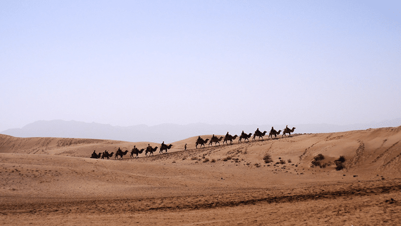
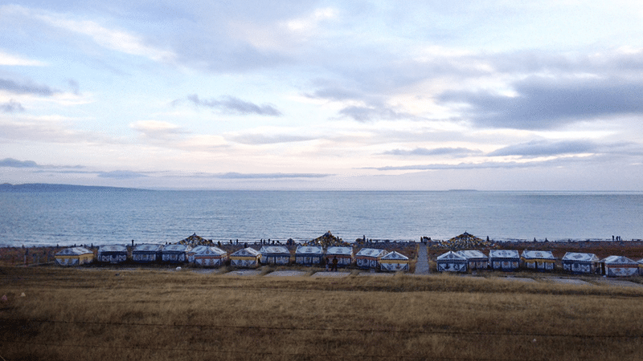
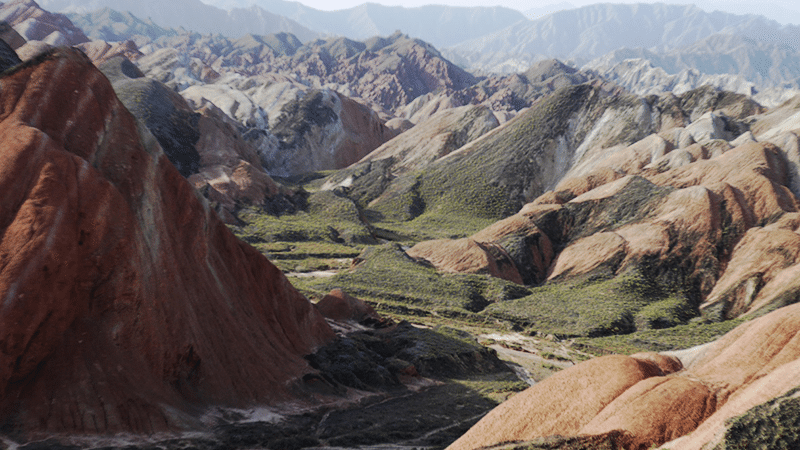
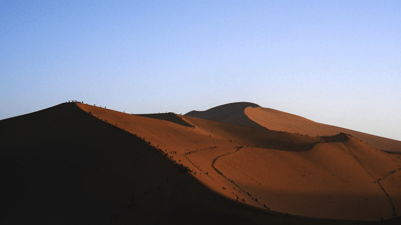
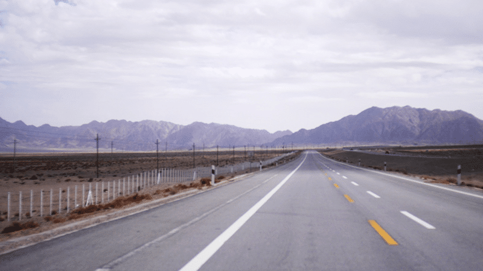
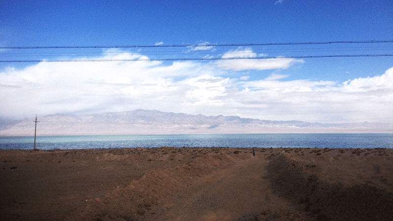
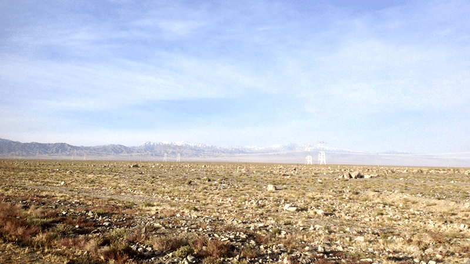
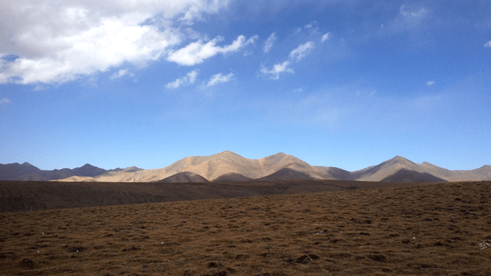

十一的时候自驾去了趟青海，有一个精力旺盛不分昼夜拼命开车的司机朋友的唯一好处就是可以每天都躺在车后座上挥着马鞭嘚儿驾一边翘着二郎腿拍照，行程虽然很赶，但也算是把祖国西部的大好河山走马观花蜻蜓点水的看了一遍。

<!--more-->

鸣沙山的月牙泉像个干瘪没牙的老太婆，嘉峪关人头攒动多的只看得见后脑勺，茶卡盐湖的黄昏大雨以及在张掖我们看着门票上的七彩丹霞奇景和眼前的红土堆，深刻感受到了淘宝买家秀和卖家秀的巨大落差。
唯一有点安慰的是翻越祁连山时看到的远方的雪山和空旷寂寥的公路，以及青海湖可以净化心灵的那片湛蓝宁静。顺道一提，我一直是一个坚定的「反穷游主义者」，我认为旅游就应该在预算充足且足够安全舒适的前提下进行，尤其是当看到山区周围鸟不拉屎寸草不生杳无人烟的无垠荒漠和连续几小时都看不到一辆车经过的静的可怕的山区国道时和联通移动电信统统罢工没信号时，豆瓣的女文青宣扬的沿途搭车的傻逼行为简直就是在作大死，还有什么沿途露宿感受自然净化心灵洗涤灵魂……高原海拔高昼夜温差大老子坐在车里开着暖风都他妈冻的跟个神经病似的。就像微博上一个朋友说的那样：「我是不懂什么净化心灵洗涤灵魂啦。但是我知道，如果一个人连对自己的生命都不负责，那么无论他去哪里旅游，看过多么澄净的蓝天，他的心都脏的洗不干净。」人丑你就多读书，人穷你就多干活当然，少看点豆瓣少看点一个，少装文青逼，多为社会主义现代化做贡献，争当四有新人。