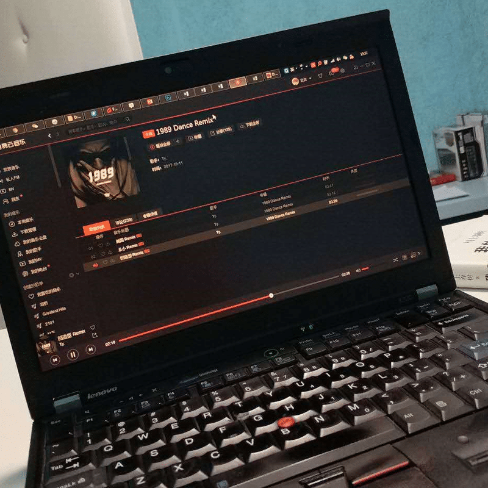

<!--more-->今年年初，自从我的 Macbook 挂了之后，我开始使用 Thinkpad x220，总价 1500 不到，装win10（这两天因为工作关系重装了系统换了win7），办公上网修图做开发，性能上从来没出过没问题。配置：
- CPU：i5-2520M
- 内存：10G（从旧笔记本上拆下来的奇怪组合）
- 硬盘：128SSD + 500G机械硬盘（从旧笔记本上拆下来的）
- 因为不玩游戏，所以不关心显卡之所以会选择 x220 是因为它组 SSD + 机械硬盘最方便，基本上 2010 年以后的电脑应付如今的日常需求都没问题，而大部分电脑卡顿的直接原因就是因为机械硬盘，所以把硬盘换成 SSD 后速度都会有明显提升，而双硬盘的好处就是在保证系统流畅的前提下，最小成本的满足数据存储。
以上所有配置划下来差不多 1500 块钱（后来又加 200 块钱换了个 IPS 屏）。做为2011年的机器，x220 肯定是停产了，淘宝上现在有的一般都是翻新或者库存货（当然了大多肯定是翻新机），如果你肯折腾且没有二手洁癖的话，可以考虑我这种方案。性能方面，开两个虚拟机再跑一堆日常应用都没问题，做些印刷品质的设计图稿或者渲点非高清的小片子都能扛得住。