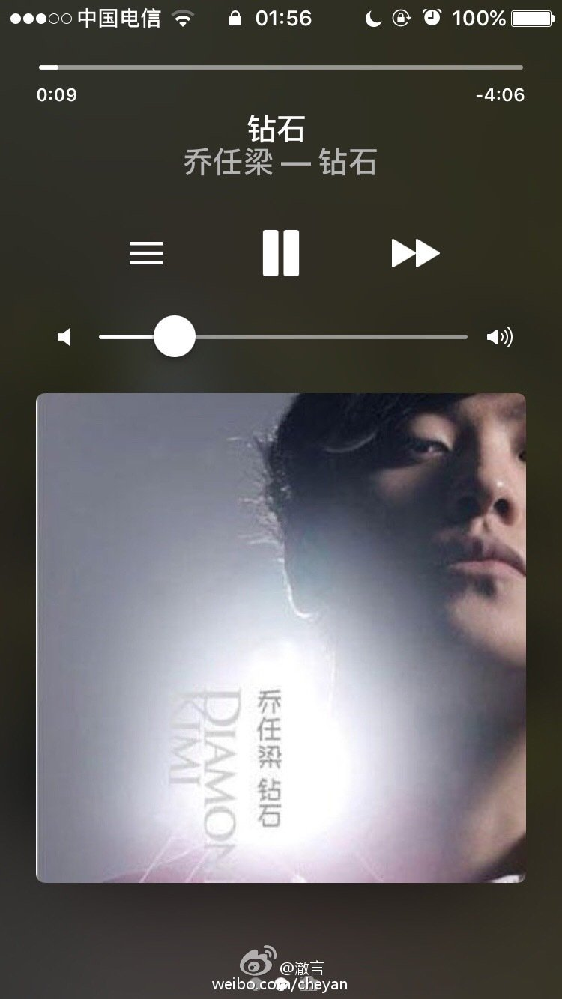

10年谷歌还没退出中国，他们投资的巨鲸音乐网也还没有倒闭，我在上面买了乔任梁 的《钻石》，那是我人生里第一张正版的数字唱片。那张专辑伴随了我刚到北京时一 穷二白的窘迫岁月（虽然现在也很穷）。一直以为他会是个很有性格的歌手，可惜最 后不知道为什么他忽然开始画起了烟熏妆，演一些莫名其妙的片子甚至唱各种吵闹糟 心的电子舞曲。到后来他的歌还会听，虽然越来越失望，可是心里总觉得没准哪天他 又能唱出《阴天气球》这种阴沉忧郁又带着一点澎湃的好歌（我知道这是黄义达写 的）。一位跟你互不相干的三流明星或许只能成为明早的热门话题，但是他曾经在你 生命里留下的那些痕迹是难以磨灭的…[伤心][伤心][伤心]

