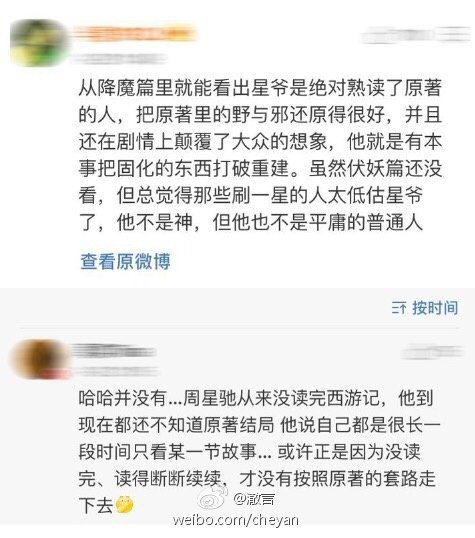

看到两个周星驰的脑残粉为《西游伏妖》洗地。 一个说：“星爷绝对熟读原著，还原得好，又在剧情上颠覆大众想象，他就是有本事把 固化的东西打破重建，那些刷一星的人太低估星爷了。” 另一个说：“周星驰从来没读完西游记，他到现在都不知道原著结局……正是没读完、 读得断断续续，才没有按原著的套路走下去。” 看来我这个给《西游伏妖》打一星的人不只是低估了周星驰，还低估周星驰的脑残粉 们。 在他们眼里，偶像的屁眼永远是香的，再臭，舔起来也香。 顺便问一句：这破电影里的人物口型为啥总对不上呢？难不成是面瘫小鲜肉们为了多 圈钱拍戏，连剧本都没背过直接念123456789？ 为何会有人能够容忍如此粗制滥造的电影？ 再一次心疼被你们黑了那么久的郭敬明。

