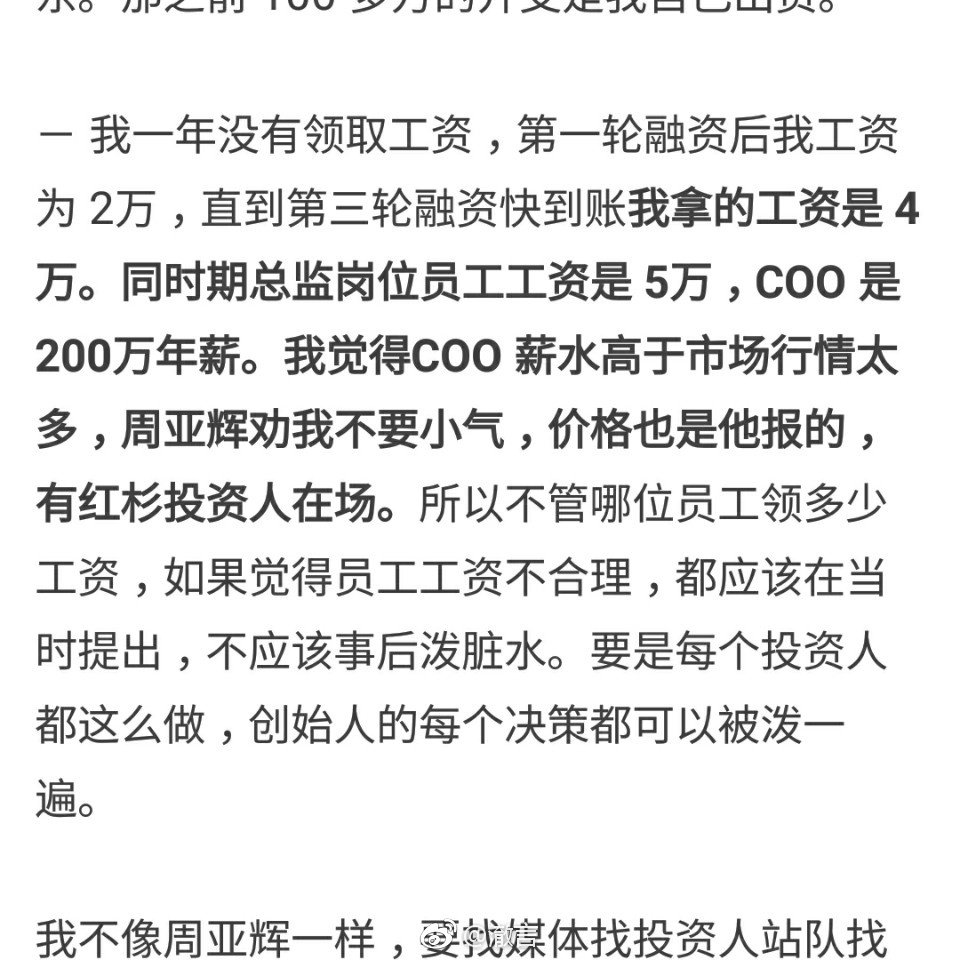

看到某90后创业者跟投资人撕逼时自曝的薪资待遇，真是惊呆了：A轮融资时工资 2w，B轮融资后工资4w。别家一般工资涨幅也就在20%…30%，涨一半都算多的了， 这位直接翻番。4w月薪是个什么概念呢，相当于阿里P8（高级专家）、百度T6（架 构师）、京东T4、网易P6……基本上都是职业金字塔最顶端的待遇了。我问了下我身 边还在坚持创业的，最高工资就没有超5位数的，交完房租水电都不剩什么了。撇开这 位创业者给“干妈”每月发的5万工资，跟男友去日本旅游美其名曰“调研日本二手市 场”……投资和创业果然都是门玄学啊。

