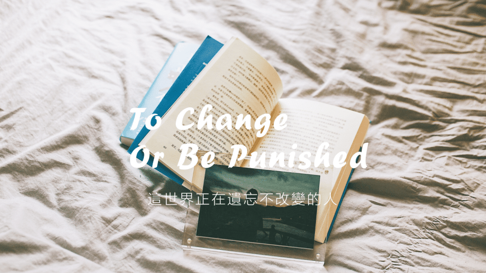
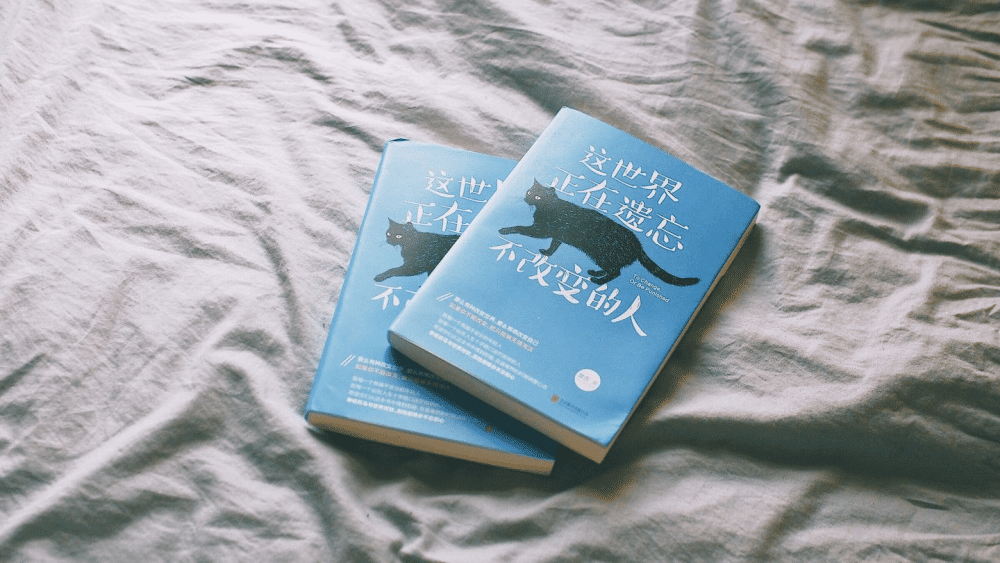
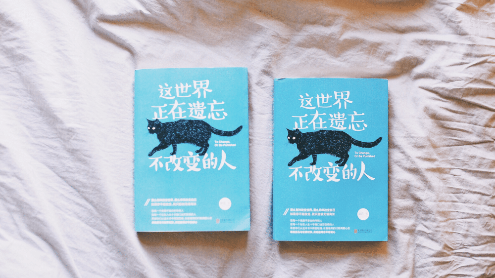
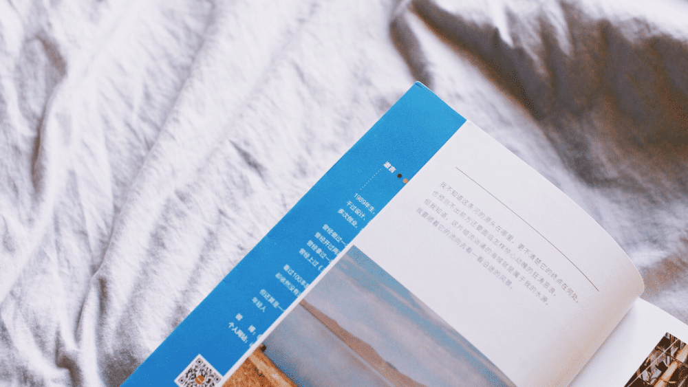

这篇文章本来应该是《这世界正在遗忘不改变的人》的后记，写下它的时候它还叫《在不安的世界里，玩命地活》，但那本书最终没有过审，这个后记也就理所应当的被废掉了，现在帖到这里，算做纪念。

<!--more-->

做为多年一事无成的失败者，文字对我来说，更多的只是一种发泄生活不如意的工具，尤其是每当我又被人背叛和抛弃地时候，每当我的事业又倒闭清算和散伙翻脸的时候，每当我跟人吹牛逼又被当场无情拆穿和狠狠打脸到颜面扫地的时候……在无数个失败受挫的场景之下，怀着满腔怨念愤恨的写上几千字脏话连篇的骂人文章，就是我黔驴技穷的最后伎俩。当然我心里清楚，这些字只是没有意义的夹杂着怒气地无声咆哮，除了会让我痛快一次爽一下以外，对曾发生过的一切糟糕状况都于事无补，甚至还会适得其反的让我继续得罪更多人。所以我从来没想过会出书，甚至也压根就不指望着有天能靠写字糊口。我见过很多比我有才华的人，他们过的比我还糟，还要郁郁不得志，他们不会包装自己更不会吹嘘成就，这些毛色暗淡不起眼的千里马甚至可能一辈子都不会被伯乐发现，到最后只能饿死成一根根毛毛虫。所以每当我失意的时候，我就更愿意跟这帮比我还失意的倒霉蛋们厮混在一起，只要一看见他们丧气的傻逼德行，我所有的不痛快就都可以烟消云散一阵子。毕竟人嘛，有时候得学会知足——因为我们都清楚，这个世界很大，每个人的梦想也很大，但可惜你我能力有限，可以让我们发光发热的机会更是少之又少。所以，今天这纸上呈现出来的一切都要感谢我的书商，虽然我到现在也没想明白你们究竟是看中了我什么。不过无所谓了，至少除了实打实的稿费以外，这本稍纵即逝的书还能让我在不成功的人生路里，有一丁点额外的成就感。在这本书里我讲了很多反“中国式传销”的鸡汤文，有部分文章之前在网上发表过，骂声一片：我说要珍惜生命不要穷游，于是就有穷游者组团要操我的妈；我说年轻没钱的日子别着急，而且着急也没用，又不能去死重新投胎，于是就有人说你这讲的都是废话我就着急我就迷茫我就想要钱钱钱你有本事就告诉我怎么赚钱没本事就别瞎逼逼；我说不要轻易的骂老板傻逼，因为有些事你可能暂时看不透，于是很多人说我混好了现在开始替老板洗屁股了；我说生活就是眼前的苟且和以后的苟且，你搞不定眼前的苟且也不可能搞的定以后的苟且……甚至我话还没说完直接就被高晓松的脑残粉们扬言要爆菊花了。幸好我向来不太在乎别人对我的看法，因为从小到大我招摇的性格和出了名的不识趣得罪过太多人，所以我这样的二皮脸死猪不怕开水烫，被人骂着骂着也就听习惯了。换个角度想想，既然大家都说时间就是生命，那人家花了它宝贵生命中的部分时间临幸了我……的文章，想到这些字能让我短暂出现在别人的生命中，人只不过是骂我两句而已，我又不可能被骂死，想一想也就更释然了，可能这就是爱的代价吧。我不在乎别人骂我，我更在意我良心上能否过得去。现在在看这本书的人，我相信我跟你一样是个爱买书的人，我们每次兴致冲冲地买一堆书回来，拆了塑封随手翻几页可能就把它扔在一角吃灰，真正仔细读过的书可能只是凤毛麟角。我们经常被精美的装帧和标题党吸引了眼球和钱包，导致买来的书最后只成为了书架上的一件件展览品。虽说这年头书价不贵，但毕竟赚钱不易，时间更宝贵，所以我真心希望我能对得起你——为了阅读这本书所耗费的宝贵时光。当然了，以上这段话也有可能被当做为了卖书而昧良心做的营销，所以到头来我可能又是说了一堆废话。这也没关系，因为我清楚无论我说什么都会有人骂，这世界里的每个人都是活在赞美和骂声的纷扰之中，但我还是想向你表达一下感谢，不管你是在书店里随手翻完了这本书，还是网上下的盗版电子书（如果有的话），又或者你只是为了买几本当红优质写手的新作，为了凑包邮而捎带脚的用优惠券换购了这本书，我都真诚的感谢你，至少你为了看这些文字而付出了你的时间。如果你看完后，觉得这本书如同XXX、XXX、XXX和XXX写的一样烂，那请你赶紧烧了它，然后去我的微博（@澈言）或者我的个人网站（http://iamcheyan.com）里留言排队跟风骂我，并在豆瓣上狠狠的给我一个差评解恨。而如果你看完后觉得还行，认为在如今的茫茫书海里还有一丁点它存在的价值，或者我的某个观点让你有了一些启发，甚至干脆只是我的某个故事让你看完后也爽了一下，那也请你找个地儿烧了它，或许没准我会托梦跟你聊聊天。我不需要你给我打五星，我也不需要你给我写书评，我甚至不指望你能够记得我和这本书，我只希望你能好好地活着，享受这生命里得到过又失去地每一样人和事。虽然这本书叫《玩命地活》，但我真不太希望你活地那么辛苦，所以，看完它，烧掉它，当做什么都没发生，继续一如既往的生活就行。祝彼此好。