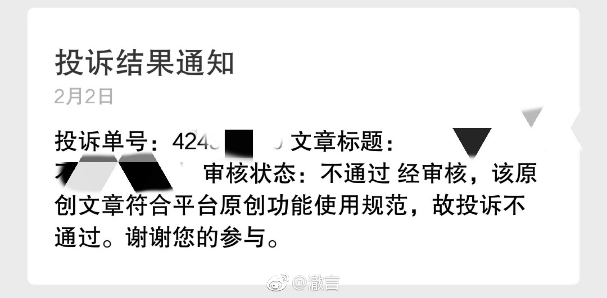

朋友看上一篇文章，我按图索骥找到原作者，结果作者打开后，说我们看到的文章是 别人盗用篡改的。 正好几天前看到朋友圈有人公号洗了豆瓣的稿，就顺手举报了，结果刚刚收到了公众 号平台的回复说“文章符合平台原创使用规范，投诉不通过”。 好吧，如果你写了一篇文章，发在了除微信公众号平台以外的地方，而别人在微信公 众号平台上标了原创发出去，微信就认为这符合抄袭者的原创规范，不构成侵权。 这个人人抄袭全民洗稿的烂时代真是糟糕透了。

📍 发布于：别人盗用篡改的。

