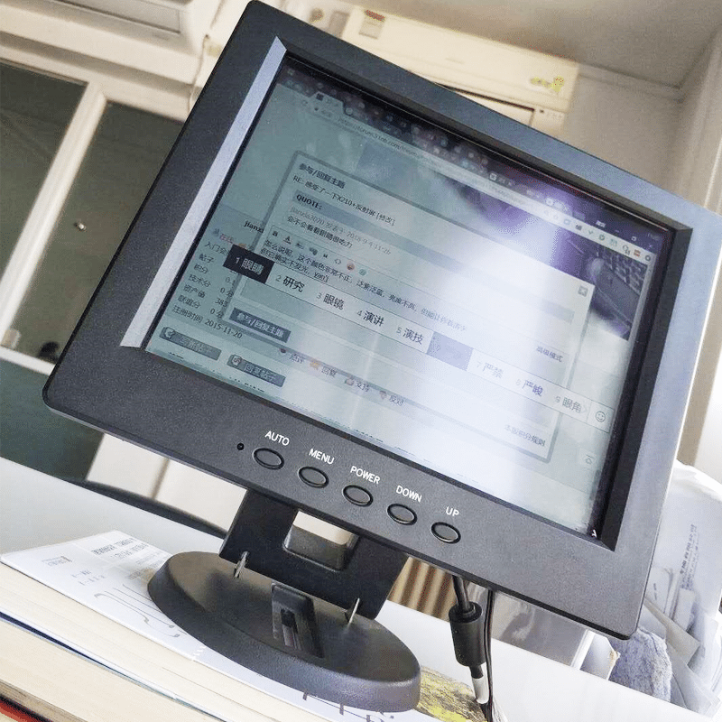
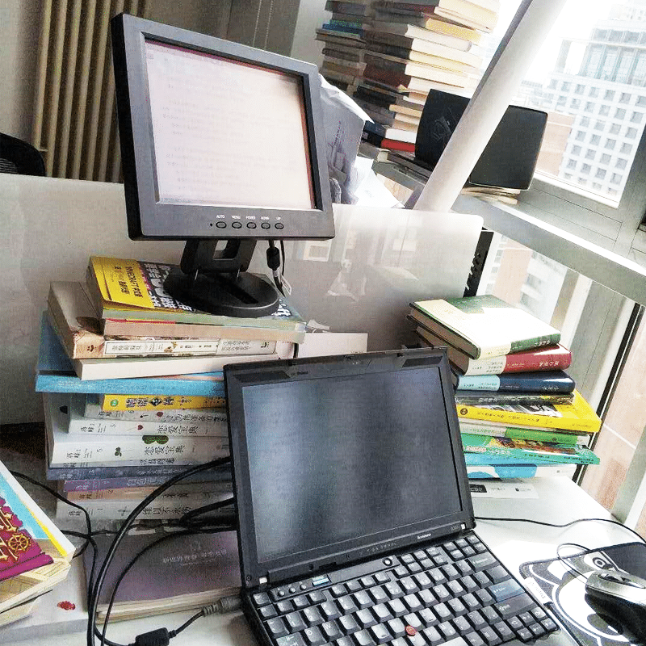
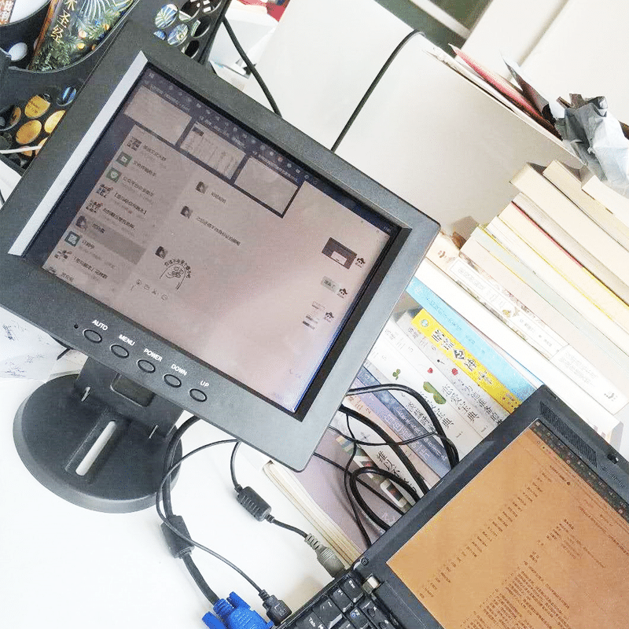

<!--more-->
最近干眼症发作得厉害，表现是对着屏幕不能超过五分钟，时间一久眼睛就干涩得厉害。
在什么值得买上，看到有人在安利全反射屏的显示器，以前觉得那种显示器就是一种智商税，但现在眼睛没法正常用的前提下，就还是想尝试用用这玩意，看看会不会好转。

先说下，市面上没有现成的全反射屏显示器，都是拿富士通 st5111 这个机器改的，而这机器多年前就停产了，所以不要指望它有全新的屏幕，能凑合用就行了。我这个是淘宝上700块钱找了家店改装的，收到后简单用了一下午，说说感受，最直观的感觉就是，没觉得有多护眼，反而很累，因为总是找不到合适的光源，而如果使用它的背光的话，整个屏幕就会显得很脏——说真的，如果开背光使用全反射屏，到还不如直接使用正常显示器呢。这个屏幕颜色显示就跟屎一样，只能看个稿子还行，先这么用着吧，以它这个屏幕的保有量，估计闲鱼上也很好出手。
