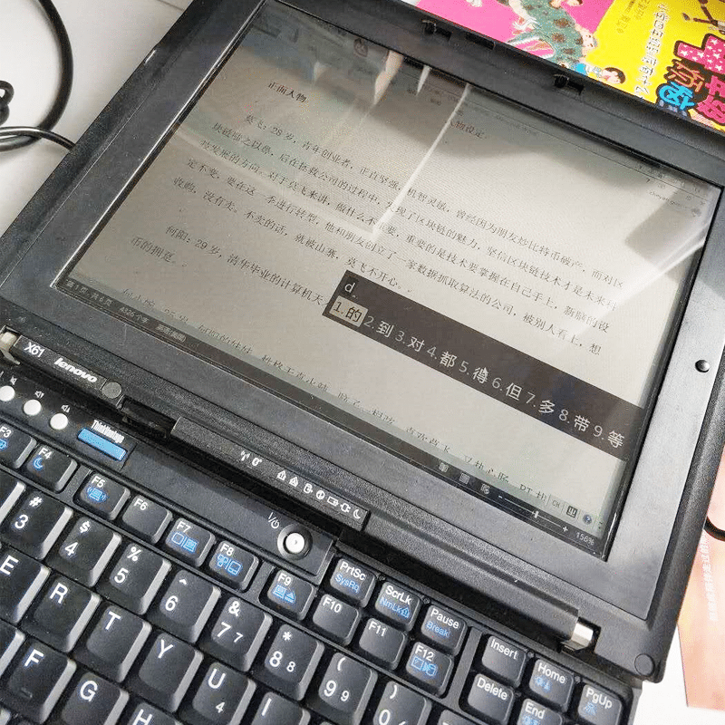

<!--more-->
是的，你没看错，X61，而且是以1649这个价格购买，我想我是疯了。
T8100 的处理器，空机，这破机器正常价格也就两三百块钱。
亮点是，改装了全反射屏，而且卖家自己设计了固定边框，还加装了屏幕带背光，右侧有一个按钮，可以控制背光打开和关闭。
谈谈感受，全反射屏对光源要求太高了，在无外部光源的前提下，基本就啥玩意也看不清，而如果外部光源够亮，那屏幕上的东西也够亮，但也只是“够亮”，远远不到“鲜艳”的程度。所以，我如果要舒服地使用这台电脑，最好的方法就是把它180度平坦开，坐在窗外，尽量让太阳光直射在它上面。
最后，护眼这事，我认为是个玄学，做为一个长期的干眼症患者，我认为最护眼的方法，是好好休息，多睡觉。

