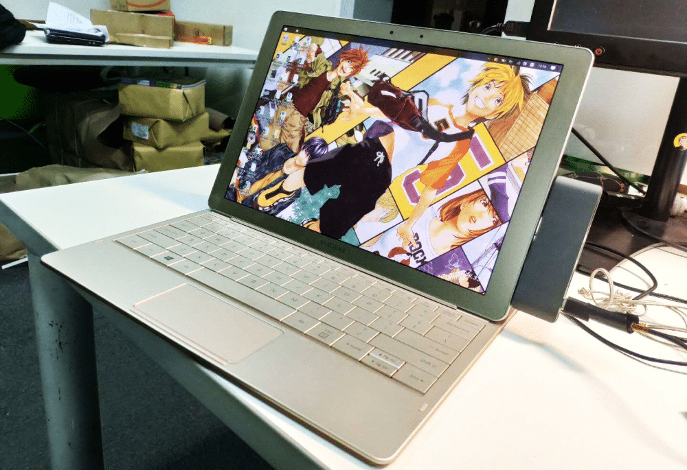

<!--more-->
重量控制不错，690克，很轻。但键盘手感一般，而且只能调整几个固定角度，用起来不是很方便，放在床上或者腿上都很别扭。酷睿M3 6Y30的处理器也就上网办公能用，硬盘网上我看有人能换，但这个后壳是胶粘的，不好拆。12英寸，屏幕分辨率 2160x1440，屏是真好。但这个机器有个充电 BUG，长时间闲置后，就充不进去电了，我看很多人都反映这个问题，最后我也不幸中招了，淘宝花了300块钱换了个电源模块才修好。总之这机器是个雷，不要碰。