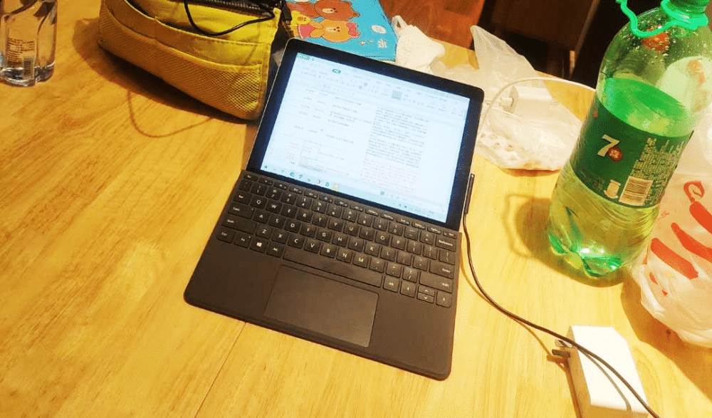
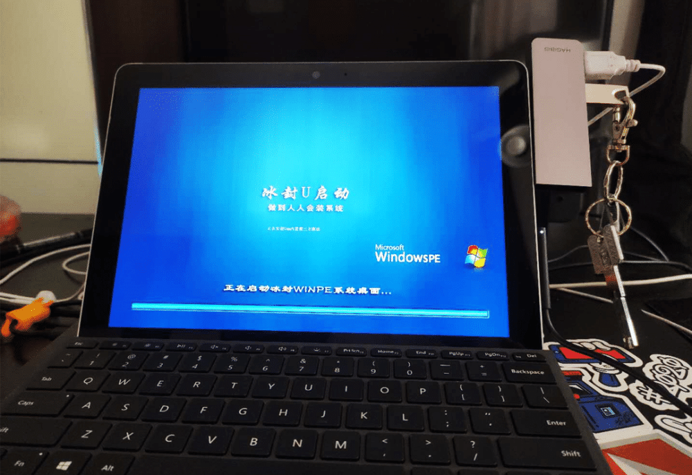
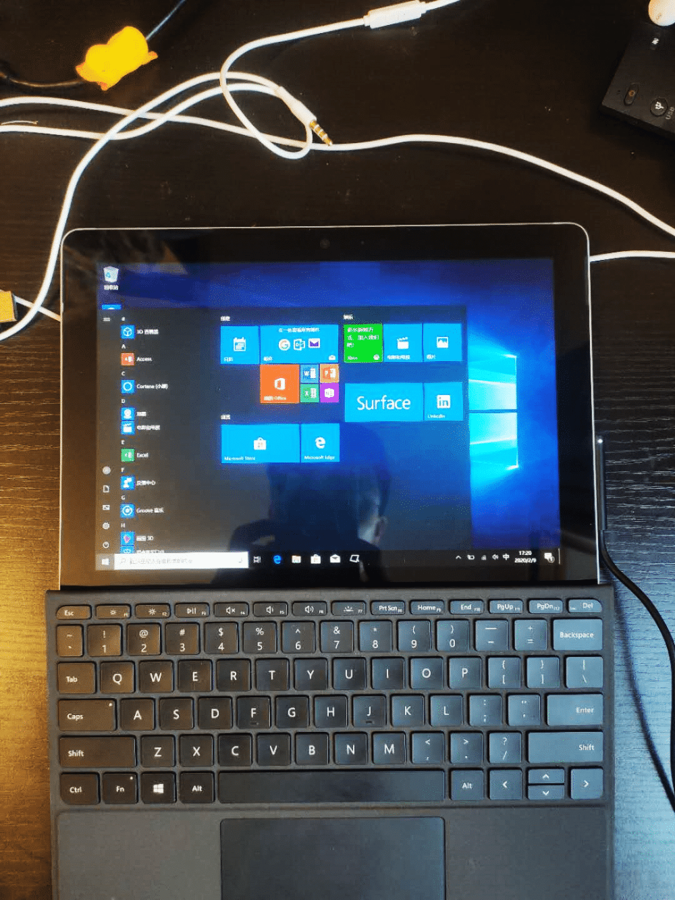

折腾了一圈，最终还是买了 Surface GO。
<!--more-->首先说说，第一感觉就是轻，600多克的重量太美好了，怎么拿着都舒服。屏幕够用，看不出像素点，大小也刚刚好。键盘不错，没有缺心眼的地方，每一个按键都在它改在的地方，不需要适应，手放上去，自然而然地就有生产力。
性能没有要求，这么一个设备，就是用来打字上网的。
但必须吐槽的就是这个接口太少，我搞不明白，既然已经有 TypeC 了，为啥还非得带着这个长长的磁吸接口？哪怕你换俩C口都行啊，这样一个可以用来充满电，一个可以用来外接显示器。
最好是能跟戴尔5285一样，两个C口，一个A口，这样还能外接一个扩展坞。
