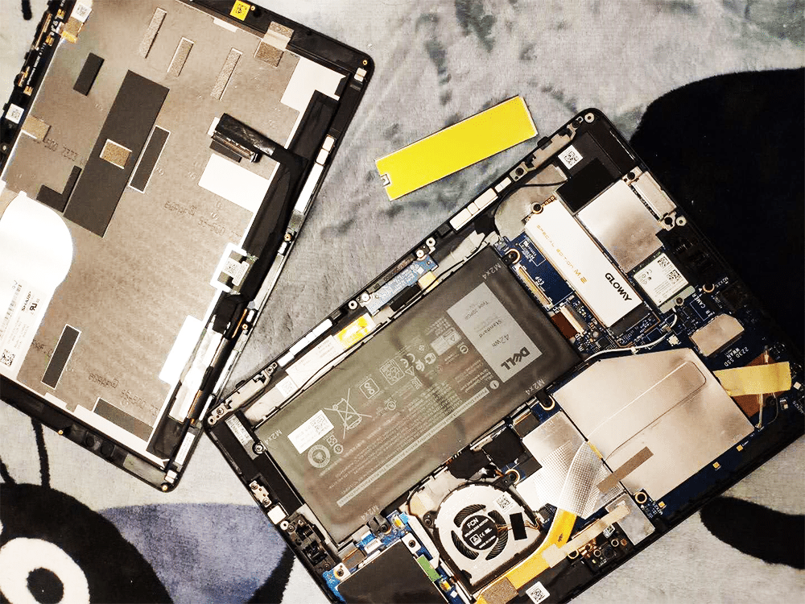
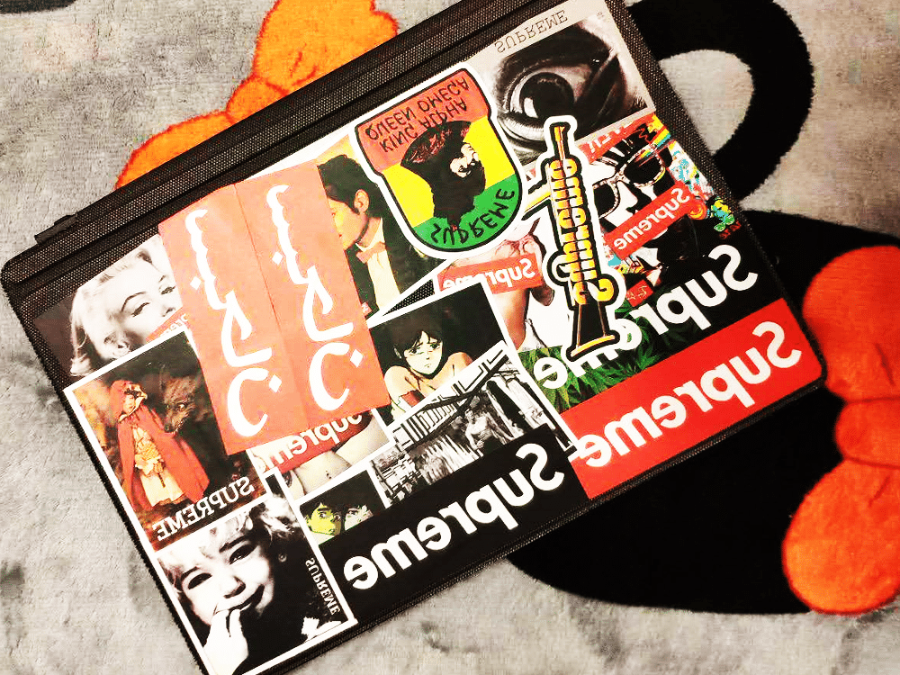

<!--more-->
戴尔还是比微软良心，同样是二合一的板子，戴尔就不用胶水，后面几颗螺丝一拧，再用卡片顺着边缘一划，机器轻松拆开。
需要注意的时，力气不要太大，因为屏幕排线是粘在主板上的，所以划开一个缝隙之后，还要找到屏幕排线接口处，把它提上来，拔掉才行。
之后就正常换硬盘即可，还要注意的是，如果你的硬盘有金属外壳，最好拆下来，这个机器比较薄，有可能你装上测试的时候，没问题，但一拧紧螺丝，屏幕就被顶住了，导致屏幕上出现白斑。