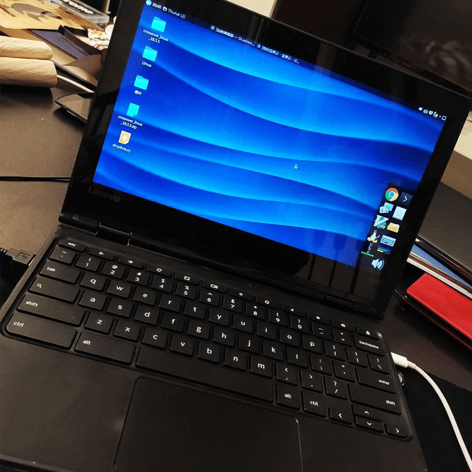

提示：全程需要科学上网先打开开发者模式，网上按你的机型搜下就有，本文演示的机型是联想500E。
<!--more-->
-
1.下载：https://goo.gl/fd3zc，获得 Crouton
在 ChromeBook 上进入 Downloads 目录，执行    sh ./crouton -x之后在 Downloads 目录下可以看到 crouton.unbundled2. 进入crouton.unbundle/targets/，用文本编辑工具打开audio文件，
第47行：    ( wget -O "$archive" "$urlbase/$ADHD_HEAD.tar.gz" 2>&1 \ || echo "Error fetching CRAS" ) | tee "$log"改为：    ( wget -O "$archive" "http://t.cn/R46YOzM" 2>&1 \ || echo "Error fetching CRAS" ) | tee "$log"这一步很重要，因为原来那个地址失效了，所以需要改到国内搬运的地址。3.安装xfce，这一步会花很长时间，约一个小时左右，中间可能会因为网络问题而失败，失败后再次执行命令就行    sudo sh ~/Downloads/crouton -r trusty -t xfce -m http://mirrors.aliyun.com/ubuntu/注意，如果你的机器，使用的是 ARM 处理器，例如三星 ChromeBook Plus，则你需要使用这个命令：    sudo sh ~/Downloads/crouton -r trusty -t xfce -m http://mirrors.ustc.edu.cn/ubuntu-ports其中，xfce可以换成 unity 、kde、xfce、lxde等环境
4.耐心等待crouton部署完成，有一步是需要你输入用户名密码，当你看到那一步，就代表安装要成功了5.安装插件（可选） - extension，配合chrome浏览器的crouton extension扩展，可以实现chromeos与chroot环境共享剪切板
 - crouton extension扩展安装地址：https://goo.gl/OVQOEt，方便与chroot共享剪切板
-
**常用命令**
启动Ubuntu子系统    sudo startxfce4如果你想卸载掉Ubuntu，则先退出Ubuntu，然后在 ChromeOS 的 Shell 里执行，注意，evilchroot为你安装的版本:    sudo delete-chroot evilchroot-
**中文化**
1、安装中文字体    apt-cache search wqy一般会找到三四款文泉驿字体，挑一个自己喜欢的安装
比如 `sudo apt-get install fonts-wqy-microhei`
2、安装中文包    sudo apt-get install language-pack-zh-hant language-pack-zh-hans
3、配置环境变量
执行sudo vim /etc/environment，在文件中增加语言和编码的设置：    LANG="zh_CN.UTF-8"
    LANGUAGE="zh_CN:zh:en_US:en"4、安装fcitx    sudo apt-get install fcitx5、如果你喜欢搜狗输入法，也可以到官网下载 pinyin.sogou.com/linux/?r=pinyin
注意区分32位和64位，方法是在terminal下输入getconf LONG_BIT看结果。返回32就是32bit，64就是64bi
6、安装
terminal下进入下载到的deb文件所在的目录，运行
dpkg -i xxx.deb（xxx.deb替换为下载到的文件名）
之后 sudo apt-get -f install 修复依赖
7、配置
fcitx框架默认没有被系统启用，需要手动设置一下
vim ~/.xinitrc编辑.xinittrc文件，内容为    export LANG=zh_CN.UTF-8
    export LANGUAGE=zh_CN:en_US
    export LC_CTYPE=en_US.UTF-8
    export GTK_IM_MODULE=fcitx
    export QT_IM_MODULE=fcitx
    export XMODIFIERS="@im=fcitx"
同样地vim ~/.xprofile，也加入上面的内容
之后sudo vim /etc/profile
在末尾添加    export GTK_IM_MODULE=fcitx
    export QT_IM_MODULE=fcitx注销后重新进入ubuntu，应该可以用ctrl+空格来切换到搜狗拼音了
8、应用设置
sudo dpkg-reconfigure locales
-
**备份与恢复**
注意，这个备份的只是 Ubuntu 系统    sudo edit-chroot -b这个会自动打包放在Downloads文件夹，但是一定要把这个*******.tar.gz拷贝到别处或者上传云盘，否则万一chrome OS崩溃，这个文件夹的东西就全没了。
恢复：
原作者给出的是这个：sudo sh ~/Downloads/crouton -f mybackup.tar.gz
但是我把备份的*****.tar.gz放到Downloads文件夹里没有成功，总是显示gz文件找不到，后来改成了这样可以顺利安装了：    sudo sh -e ~/Downloads/crouton -f ~/Downloads/********.tar.gz上面的步骤执行玩不出错的话应该会提示输入用户名密码，如果出错的话因为用的是sh -e，所以会中断在错误的地方，bing一下看看是什么问题，对症解决在这之后，terminal下面输入sudo startxfce4，一般就能开启chroot ubuntu了按住ctrl+alt+shift加前进后退（类似F1、F2的位置），可以在chrome os和ubuntu下来回切换