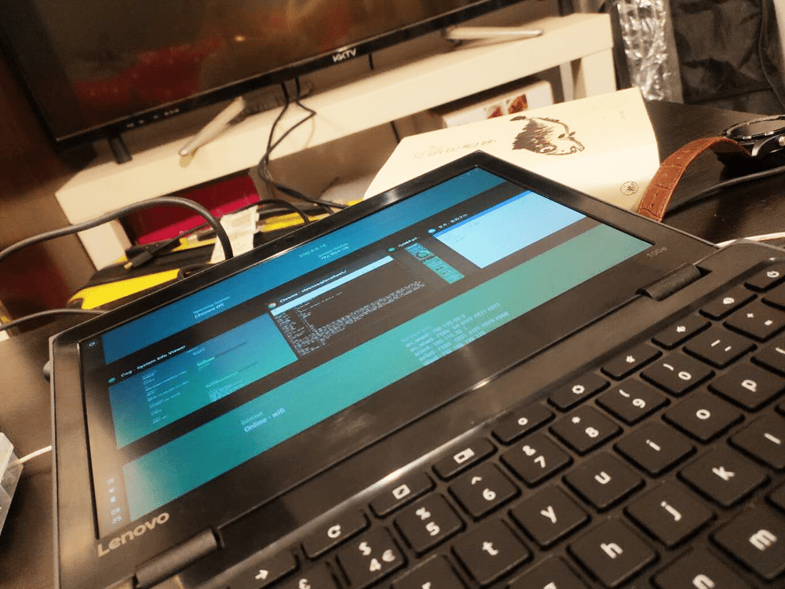
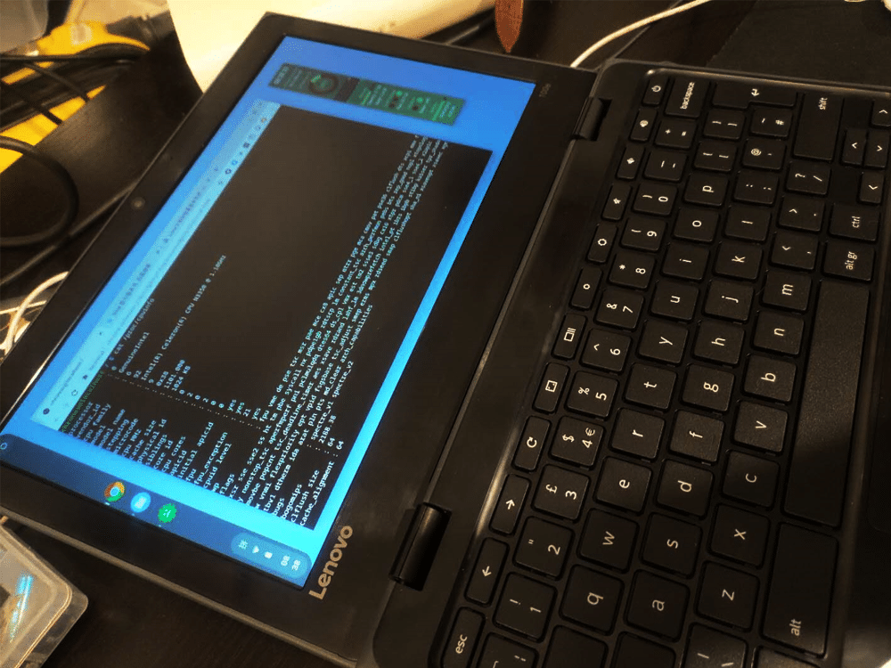
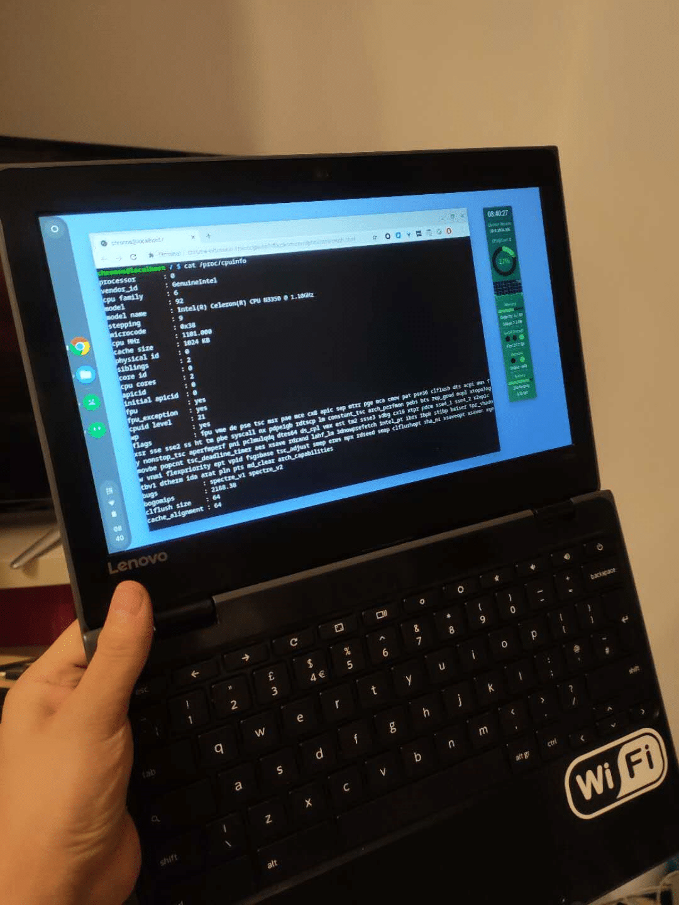

<!--more-->
ChromeBook 低端本的屏幕都比较破，基本上都是 1366*768 的 TN 屏，完全没法看。
朋友拿来一台 联想 ChromeBook 100E，说看看能不能给换换屏，研究了下，发现这个和之前换屏的宏基 C740 一样，30针EDP小口，ips 屏幕型号 b116xan04.1，店家说海尔的这个机器也可以用，目测只要是搭载了TN屏的 11.6 吋的谷歌本，应该都可以用这块屏幕（个人猜测，不一定正确）。