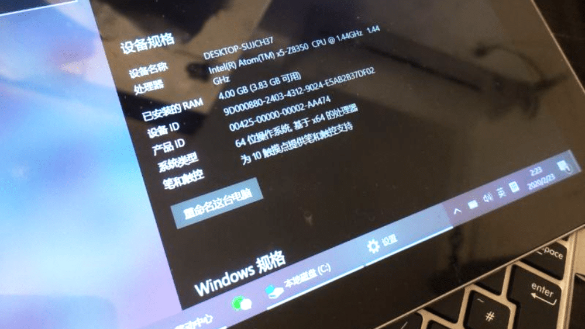

<!--more-->
华硕 T102ha 二合一平板电脑，最大亮点可能就是重量了吧，单机600克，带键盘700多克。
10.1吋，尺寸 17 x 25.9 x 1.3厘米，厚度8.2毫米重量和尺寸和 surfaceGo 相当，但价格闲鱼上也就六七百块钱左右，可是一分价钱一分货，阿童木的处理器也就看个乐，性能比较捉急，干不了重活，但做为随身便携本，记录个东西上上网很方便。键盘按键虽然小，但该有的键都有，不缺斤少两，回弹也还可以。
电池能够连续使用4-6小时。机身接口有标准USB，micro USB，micro HDMI，Micro SD和耳机插孔。
亮点是 Micro USB 的充电口，可以以使用手机充电器、移动电源，甚至笔记本电脑的 USB 接口直接充电。
这个还是很方便的，基本不挑充电环境，充满电后，电池能够连续使用4-6小时。