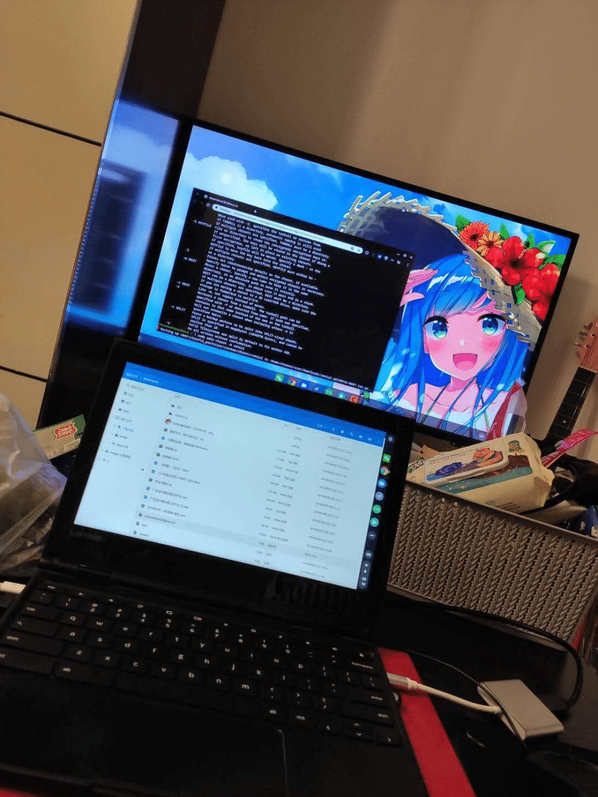

这机器最大的亮点，就是待机太猛了，如果合盖休眠，感觉一星期，电都不会掉——哪怕是在 Linux 子系统下，随时就能打开，打开就能干活，这种体验还是蛮爽的。
<!--more-->对我而言，这台机器的缺点，主要是输入法的缺失，ChromeOS 下基本上没有能用的输入法，加上我又是双拼，选择更少，使用Linux 子系统倒是不错的选择，切换也顺畅，在 Linux 下，就是一台正常的电脑，能干的都可以，触屏也正常，只是性能太捉急，除了谷歌亲儿子系列以外，其他的 ChromeBook 基本没有什么太高配的机器，似乎标配都是赛扬 N4100，这也就注定了你拿它干不了重活。需要注意是，你如果使用三星的 ChromeBook，则要注意看下你的机器，是不是 ARM 的处理器，如果是的话，就比较尴尬，本来 Linux 下的应用就少，适配 ARM 的就更少了。最后，说说网络，除了刚到手激活时需要科学上网，其它时候对网络环境没有要求，当然，一个良好的网络环境，无疑能够帮助你更好的使用 ChromeOS。