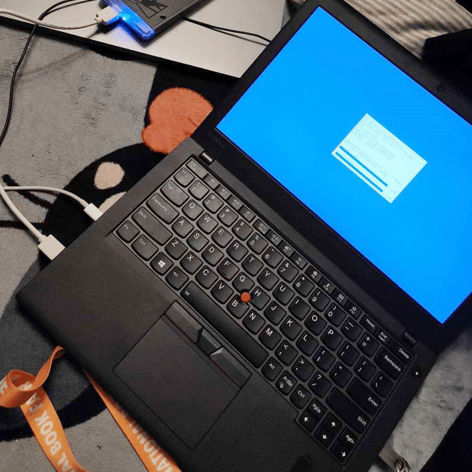

<!--more-->
鬼迷心窍地买了这个机器， A12 88308 R7 的CPU，跟 X270 一样的模具，看着很美，而且比 X270 能便宜一千多快钱。鲁大师跑分15万分，纸面数据也不错，但不知道为什么，用起来就是奇卡无比，这种卡顿是全局的，开机慢，上网滑动网页也肉眼可见地延迟，甚至有时候打字都觉得慢一拍。重装了系统、驱动，均无效，后来怀疑是硬盘的问题，就买了个 NVMe 的转接卡，转接了三星的 PM951，寻思着硬盘速度提上去了，应该会流畅些了吧，但使用起来，一样让人烦躁。怪不得都说  的拖拉机架构不能碰，社会社会。