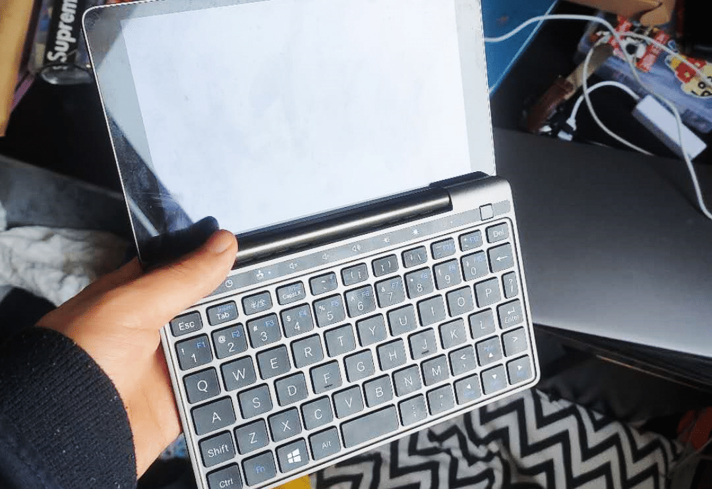
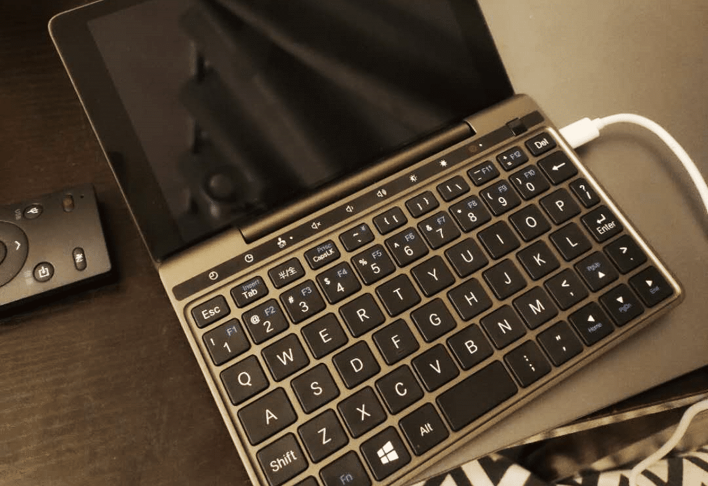
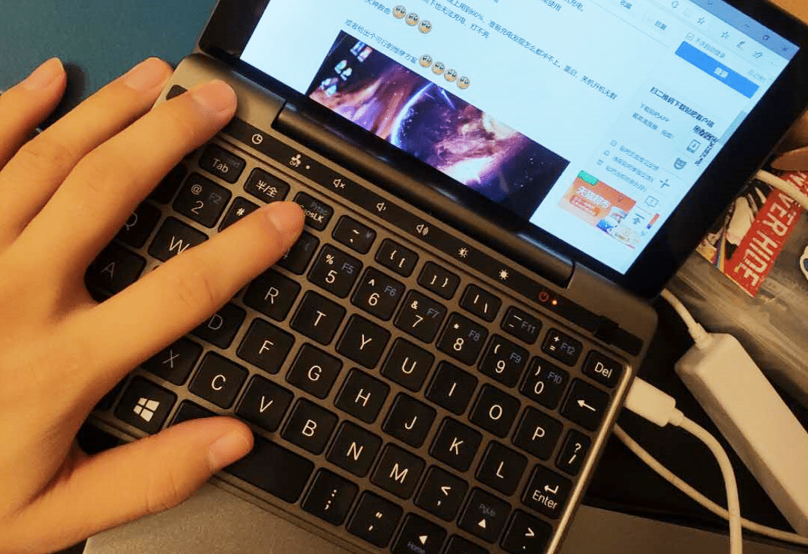
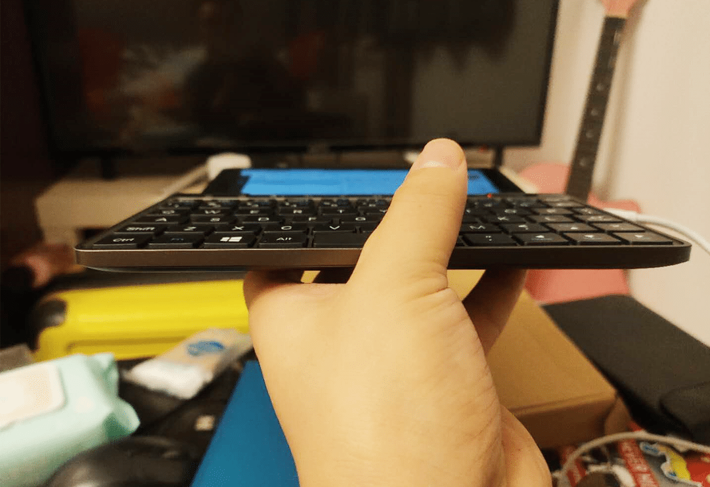

想买口袋本的原因，无非就是希望能装在兜里，走哪都能写点东西。精挑细选后，入了 GPD 的 Pocket2。

<!--more-->
第一感觉就是接口太少，两个 USB-A 口，一个 TypeC，一个TF卡槽——竟然连 HDMI 都没有？要知道，你这么小一个屏幕，平时用时肯定是要外接显示器的，如果通过 TypeC 接显示器的话，则充电又是个问题，而充电+外接显示器的扩展坞又比较贵，所以这机器接口方面，差评。
第二个差评就是左右这厚厚的边框了，太厚了，无力吐槽。
第三个差评是键盘，不知道为啥非得把 WASD 设计得如此靠左？你就按照正常的键盘键位排列不行吗？
就这么一个脑残键盘，把我对使用它打字的全部幻想都浇灭了，残念。