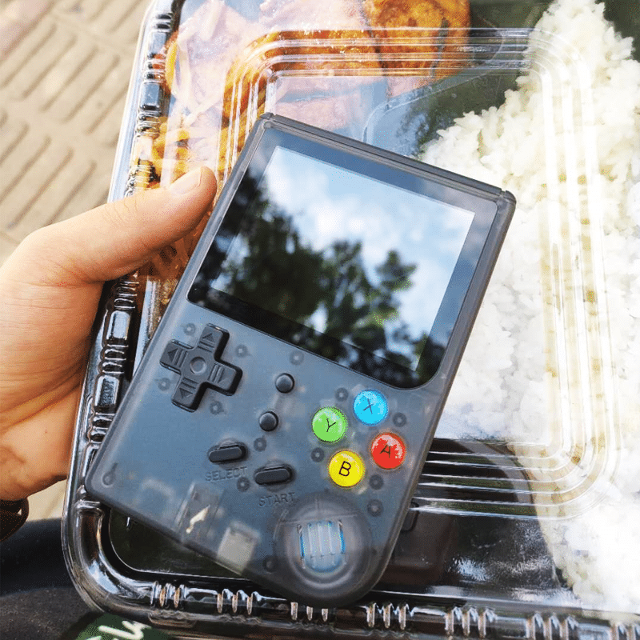
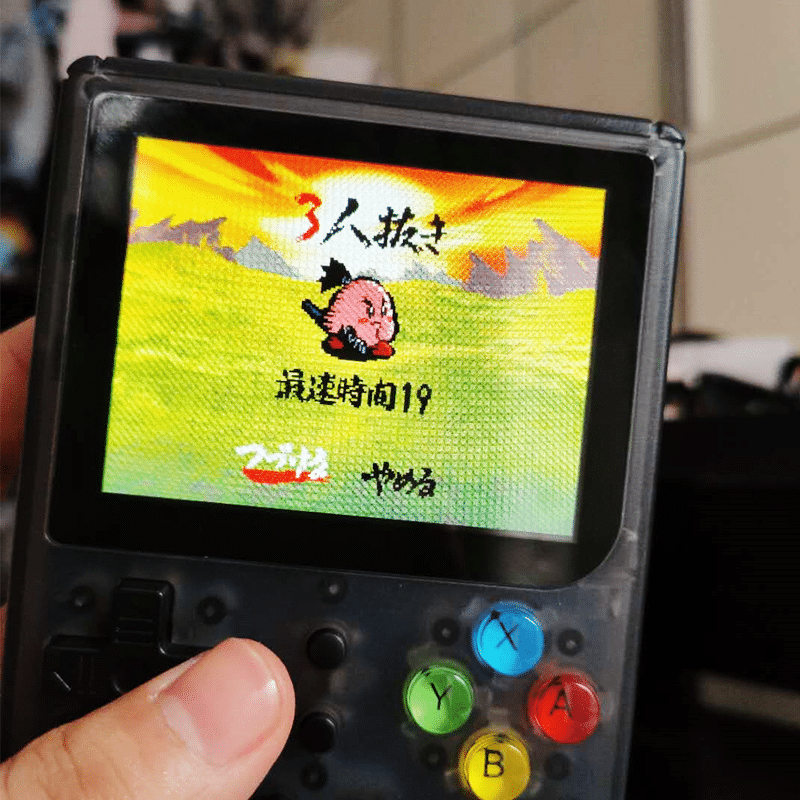
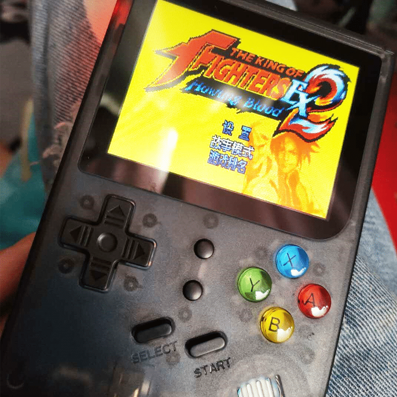
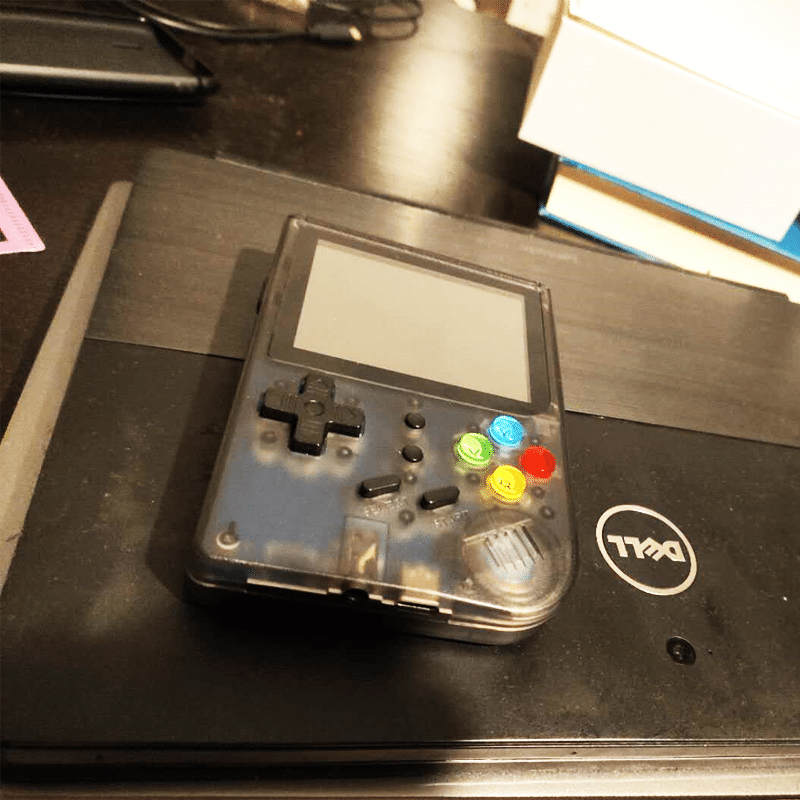

<!--more-->
一时心血来潮，买了这么一个东西。入坑原因是这个透明版本的壳子太好看了，竟然还是 TypeC 口，但到手后才发现这个C口除了充电外，啥都干不了……并不能外接显示器来使用。
跟店家沟通后，寄了跟三色线给我，让我插电视上看看，结果折腾一圈，告诉我，可能是我家的电视 KKTV 不支持。
行吧，那就只能在手上玩了，但这就会遇到另一个问题，就是它这个屏，真的是其烂无比，是我有史以来见过最烂的屏幕，偏色、亮度低、还会莫名花屏，总之就是一堆问题。
建议闭坑，有这三百多块钱，干点啥不行，何必要委屈自己的眼睛呢？
