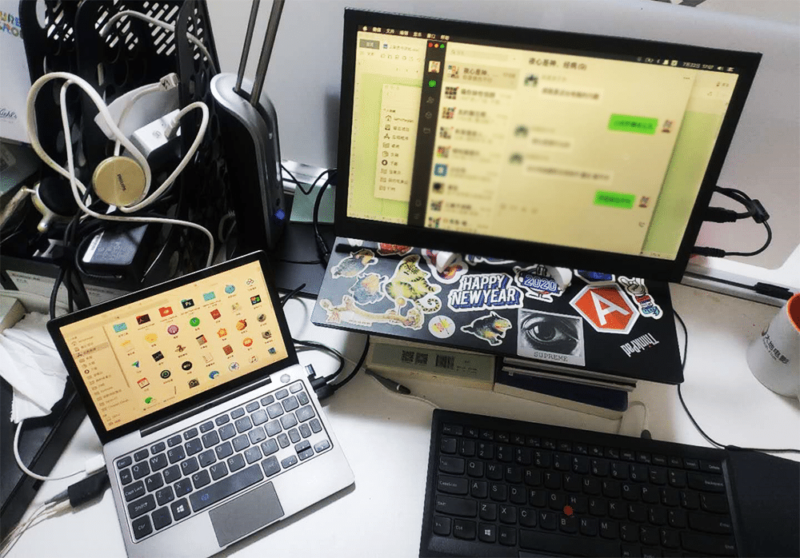

<!--more-->
最开始是在B站看到这机器的评测，当时就心动了，8.9吋，体积跟 iPad Mini 相当。顶配 M3-8100Y 性能相当于I5版本的X250，日常办公足够用。重量600多克，也就相当于带了一两本书。太适合做为随身笔记本携带了。除了那个 HDMI 接口使用的是 MiniHDMI 以外，其它基本都符合我的需求。尺寸很好，很轻，触屏不错，带着方便。
不过使用几天之后，发现这机器还是存在着一些明显不足：- 散热模式太激进，风扇极其之吵，随便开个WPS就嗡嗡响，夜深人静的时候敲点东西，会被狂转的风扇吵得人头疼，而且已经刷了官方最新的BIOS驱动，并设置了静音模式，屁用不顶，[我录了一个视频你们可以听听声音][1]；- 键位依旧奇葩，F11，F12，DEL，逗号，冒号需要配合FN使用，输入起来极其不方便；- 键程太短，敲起来不痛快。
PS：不过这机器可以刷黑苹果，如下图：
  [1]: https://www.bilibili.com/video/av69765565