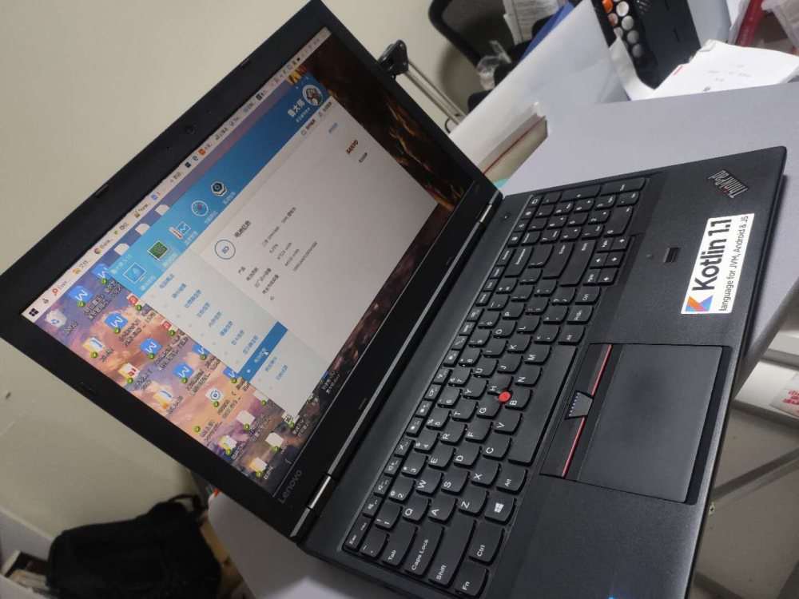
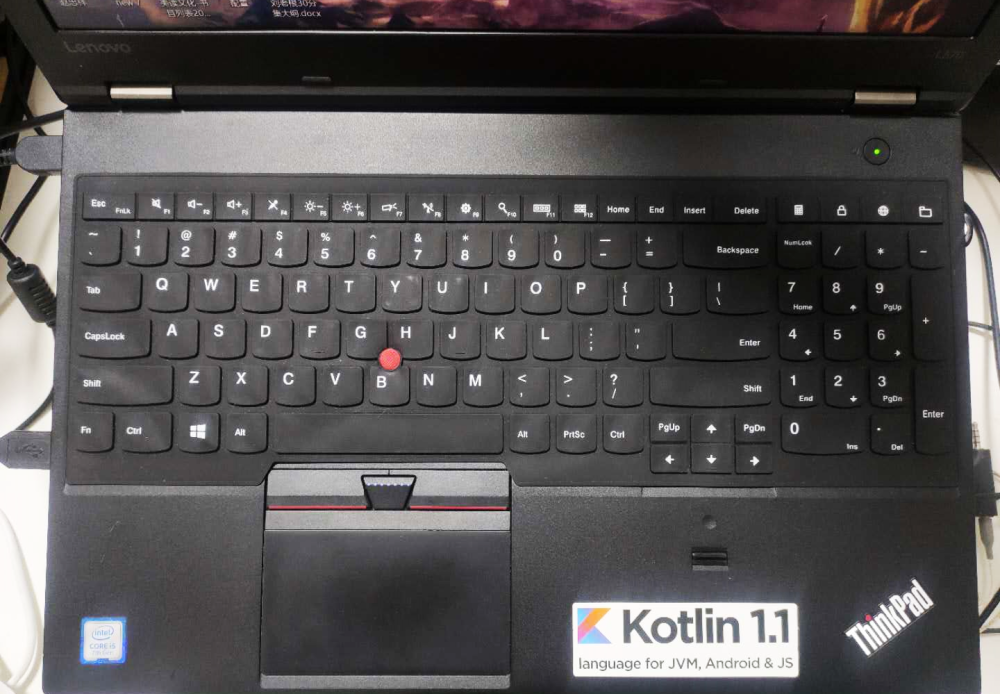
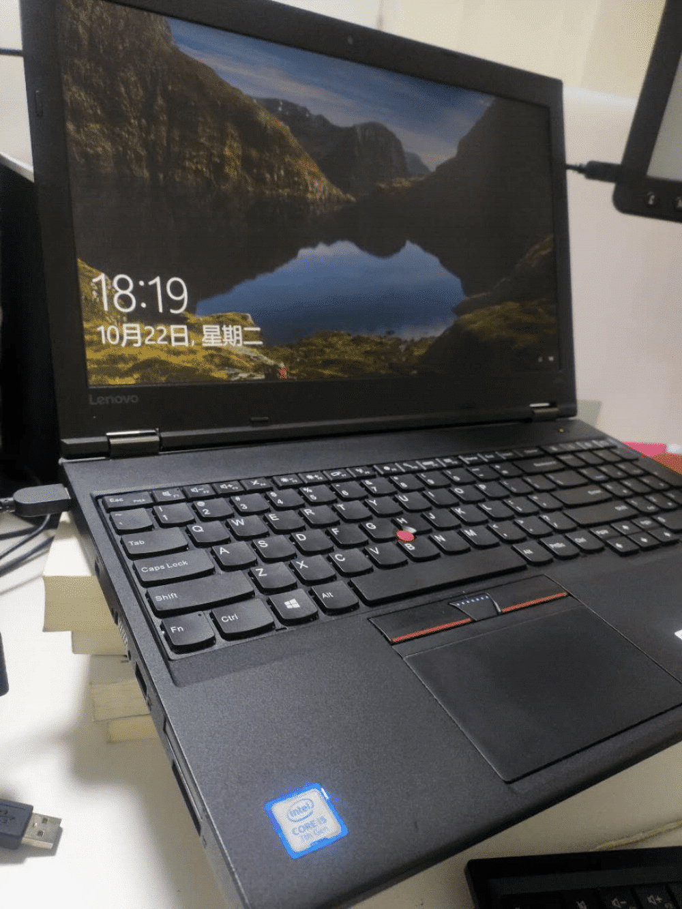

<!--more-->最近把屏幕的DPI调得越来越高，字大了，不费眼，但显示的东西就越来越少了，索性买个大屏机器，正好看到一批日版的L570在出，不知道为什么，L系列的机器，大多都是日版键盘，想来应该是日企定制，好在可以换键盘。换好键盘后，但总感觉按键软塌塌的，可能是我装配不到位？就又买了个键盘膜套上，终于舒服了。
说说感想，L系列很皮实，沉，但看着很可靠的样子。
不过7代机器用的还是老式的联想充电口，不能 TypeC，这点不和谐。
