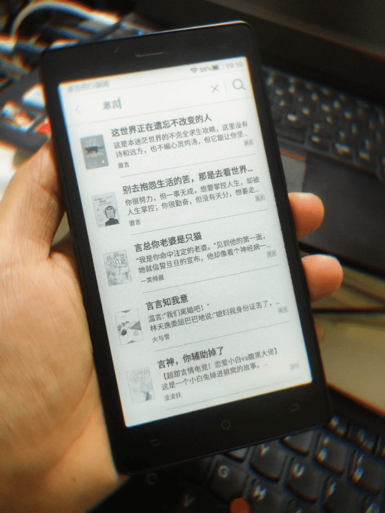

<!--more-->
买这个是想随时能掏出来看稿子，但又不想用手机那么费眼。墨水屏是个好东西，但它舒不舒服，我认为，主要靠背光，如果没有背光，那么你想看清楚墨水屏（或全反射屏）上的内容，就需要更使劲地挤眼睛，那样反而会加重视疲劳。在日间室外可能还好，但如果在家里，或亮度较低的区域，那么背光就显得十分有必要。背光分为白光和暖光，白光就是灯直接打进来，惨白惨白的，很刺眼。暖光就相对揉合，类似手机的夜间模式那种。所以，最好的墨水屏阅读器应该是：TypeC接口，然后白光加暖光的组合，可以自己根据使用场景，调节各光源的亮度，达到最舒适的护眼效果。口袋阅则不满足以上的标准，它使用 MicroUSB 接口，且只有一种白光，十分刺眼。
很失望。PS：但好一点的是，它自带的书城里能搜到我出版的两本书。