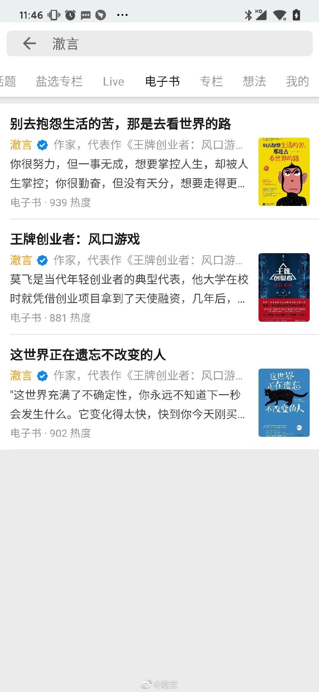

#少年的你作者否认抄袭#几年前，电影《达芬奇密码》的同名小说被指责抄袭《圣血 和圣杯》，因为故事的核心点，都是设想了耶稣曾结婚生子，血脉传承的故事。 当时网上报道说是：作者丹·布朗借用了《圣血与圣杯》的故事主线，又自己编了大量 内容，才写出《达芬奇密码》。 但最后，法院判抄袭不成立。因为“融梗”这种操作无法界定它的原创程度，顶多只能 从道德层面抨击，而律法层面，可以扯皮的地方太多了。 说这个，不是为某些作者融梗做辩解，只是想说，文学作品原创性的鉴定在全世界都 是个难题，跟国情无关。 所以大家没必要动不动就上纲上线，说什么“中国抄袭没人管”“中国原创没希望”，搞得 好像这是中国特色一样。

