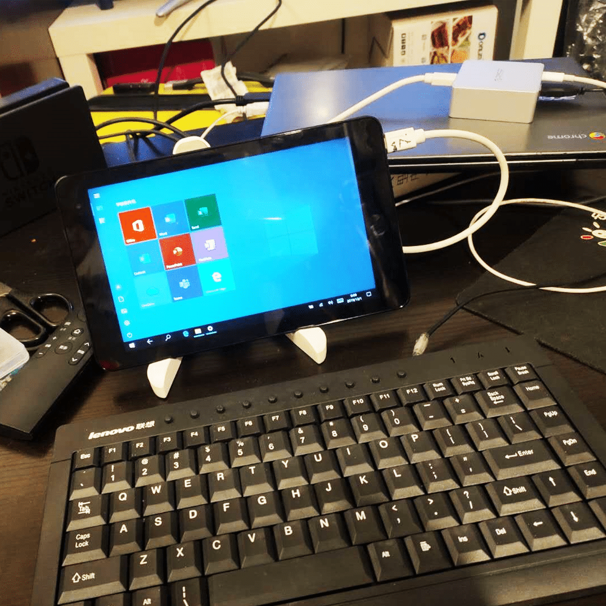
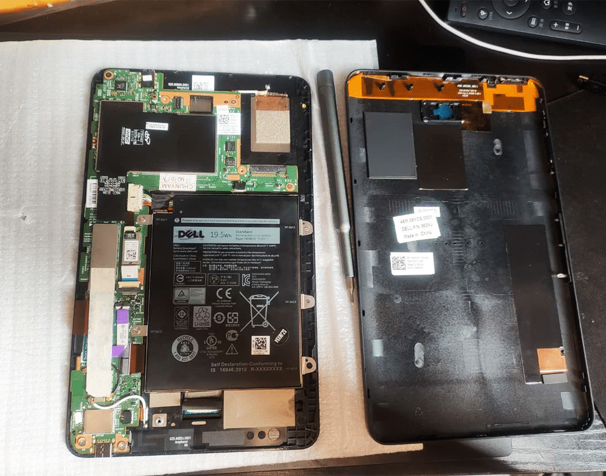

出于对迷你本的喜欢，又刚好看到闲鱼有人在出这个板子，价格不贵，加上屏幕也才600块钱左右，自己配个壳子就能用，便入了一台。
<!--more-->
屏幕分辨率很渣，但好在屏幕小，1280*800的分辨率也够用，摄像头没有需求就没装。但CPU更渣，阿童木Z8550，也就只能上上网了，哔站看1080P都卡。单机重量控制的不错，380克，跟手机差不多重。

本来打算放家里当上网本用，后来才意识到这货只有一个TypeC接口，接键盘、显示器、鼠标、电源，又得需要一个给力的扩展坞，又是一笔不小的花费。残念。