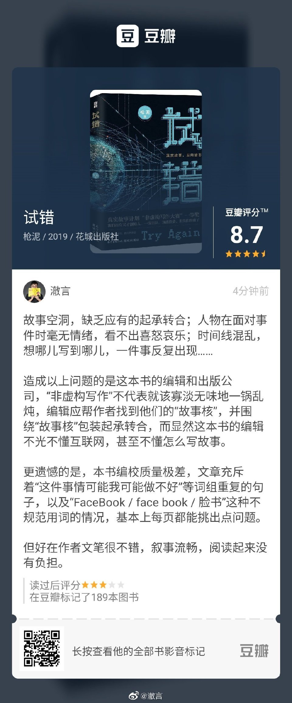

读过图书《试错》我的评分:★★★☆☆ 故事空洞，缺乏应有的起承转合；人物在面对事 件时毫无情绪，看不出喜怒哀乐；时间线混乱，想到哪儿写到哪儿，一件事情反复出 现…… 造成以上问题的是这本书的编辑和出版公司，“非虚构写作”不代表就该寡淡无 味地一锅乱炖，编辑应帮作者找到他们的“故事核”，并围绕“故事核”来包装起承转合， 而显然这本书的编辑不光不懂互联网，甚至不懂怎么写故事。 更遗憾的是，本书编校 质量极差，文章充斥着“这件事情可能我可能做不好”等词组重复的句子，以及 “FaceBook / face book / 脸书”这种不规范用词的情况，基本上每页都能挑出点问 题。 但好在作者文笔很不错，叙事流畅，阅读起来没有负担。

