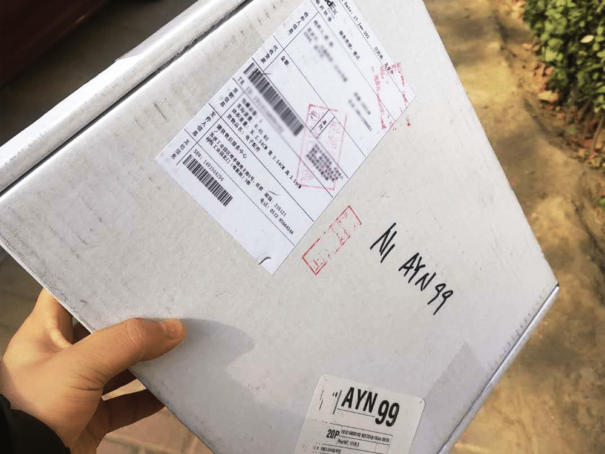
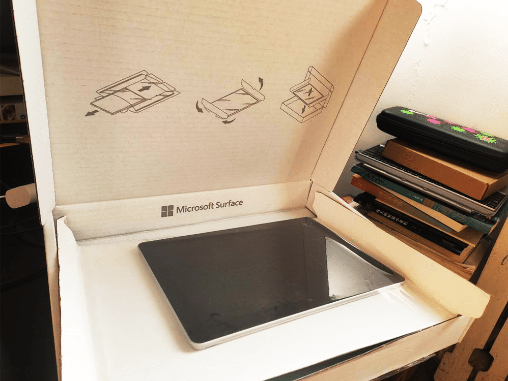
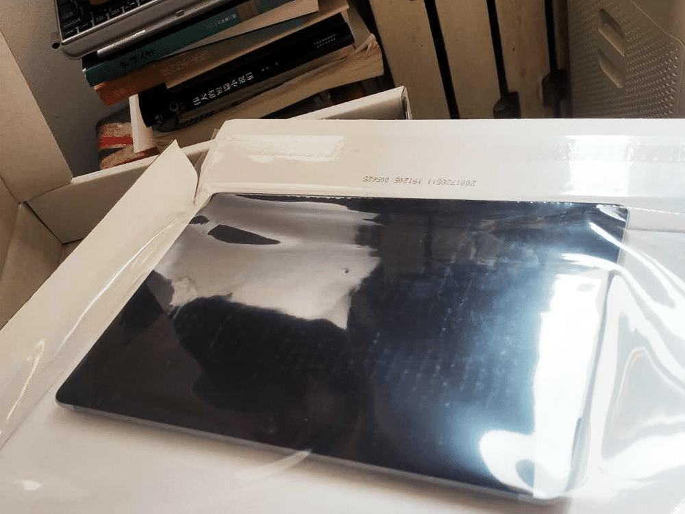
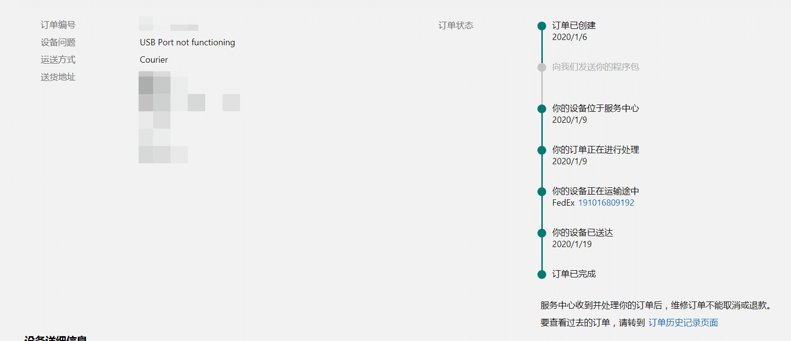

<!--more-->

Surface GO 的 TypeC 接口忽然失灵了，不能充电，也不能转接，就跟死了一样，尝试过网上能搜到的所有方法，均不能奏效。初步怀疑是我使用了劣质的 TypeC 扩展坞所导致。无奈只能返修，返修的话是直接在微软官网提交订单，之后联邦快递会上门来取件，只拿走有问题的机器，键盘和电源就不用给他们。
维修速度还挺快，我一月六号提交订单，一月十九号就寄回来了。
返修带的这个包装还挺有意思的，是用一层薄膜把机器保护，不像其它快递总是缠得一层又一层。
但是！没修好！这次机器的 TypeC 接口能使用 USB 了，但依然不能充电，无论使用充电宝还是直接电源，均无效。
这样的话，出门就必须带着原装的磁吸接口充电器了。
再次给微软售后打电话，售后建议我……就这样凑合用吧。