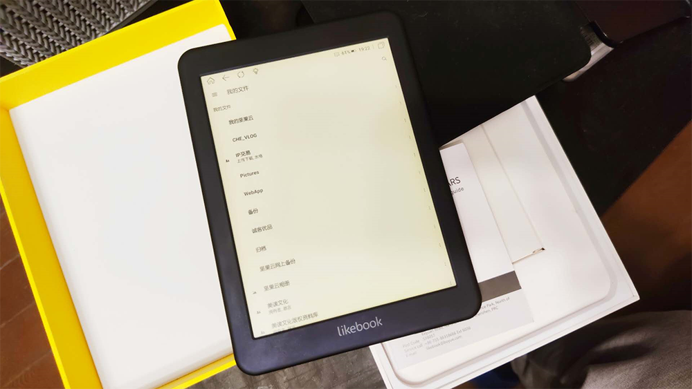
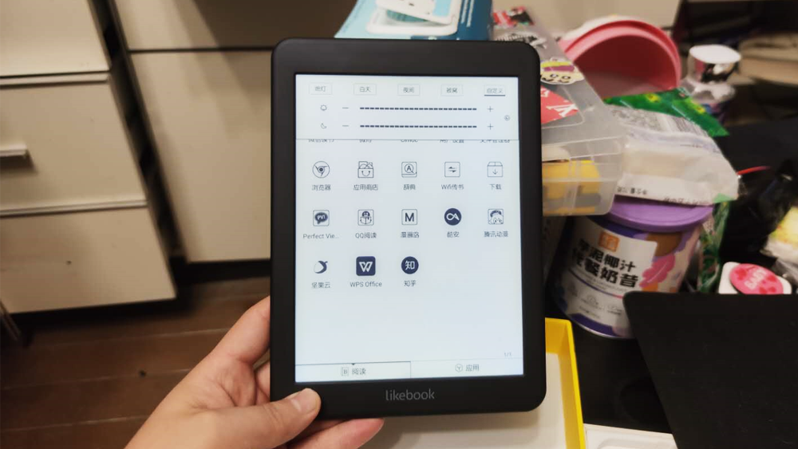

<!--more-->感觉还是需要一个电子书阅读器，一番挑拣，最后选了博阅的这款机器，因为它使用无锁安卓，可以自由安装应用，并且有冷暖光，且冷暖光的亮度都可以单独调节，我最喜欢把冷光调最低，暖光调最高，这样看着十分柔和，眼睛舒服。
博阅这款支持内存卡，存点漫画看比较方便，但还是感觉这个屏有点小，看漫画字有点费劲，机器刷新率一般，难免还是有拖影。博阅的系统优化得不错，无线传输很方便。
当然，最喜欢的还是闲时自动关机的功能，大部分买电子书阅读器，吃灰的时间巨多，常常是打开看一会放下，自动待机就把电耗光了，下次想用的时候，打开还得再充电，博阅这个一会不实用，就会自动关机。下次打开还有电，十分舒适。
但是，这机器最大的问题是：非 TypeC 充电口，差评。