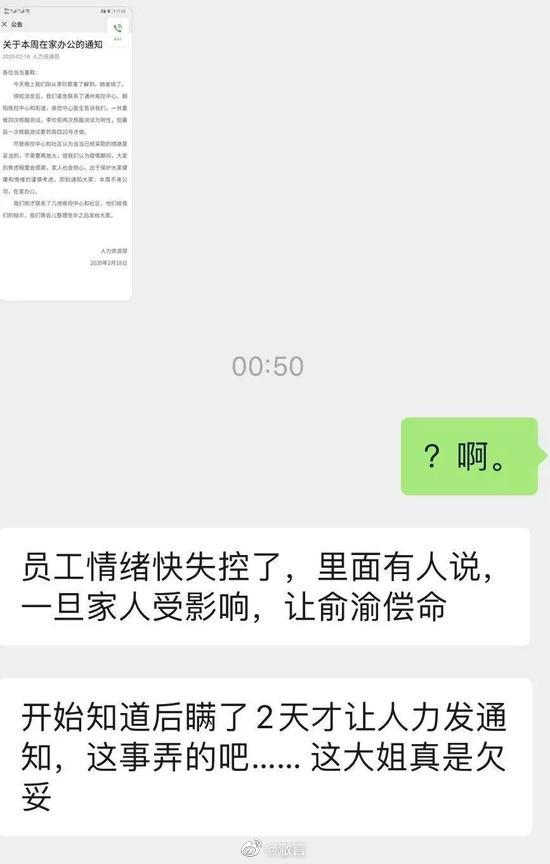

#当当证实一员工确诊新冠肺炎# 做为一个写书的，我的每本书当当曾经都给过不错的 推广资源，当当公司里面也有我不少的好朋友，我的前老板陈腾华也是当当人，给过 我很多帮助……所以我对当当还是很有感情的，但最近当当的一些举措我真是不能理 解： 2月9号，当当网董事长兼CEO俞渝发内部信，表示“新冠肺炎不可怕，呼吁员工及早复 工”，最后还说“当当人不浪费一场危机”； 2月16号，微博说当当网员工母亲确诊新冠肺炎，此时该员工已经在公司上了三天 班； 2月16号晚上，当当说微博上所传内容并不属实； 2月18日，网曝该员工于出现发烧症状，当当紧急发布公告通知公司全体员工本周在 家办公； 2月20日，网传当当前夜召开了内部电话会议，会议向全体员工传达了此前那名母亲 确诊新冠肺炎的员工，最新一次核酸测试呈阳性，也就是确诊的消息。 知道当当这些年遇到了很多困难，也明白创业不易，但疫情当前，毕竟是人命关天的 事，谨慎一点总没错，而最让我震惊的还是俞渝的那句话：“当当人不浪费一场危 机”。 把一场国难当做“弯道超车”的好机会，无语…… 要知道，你投入弯道超车的弹药，是你员工的命。

