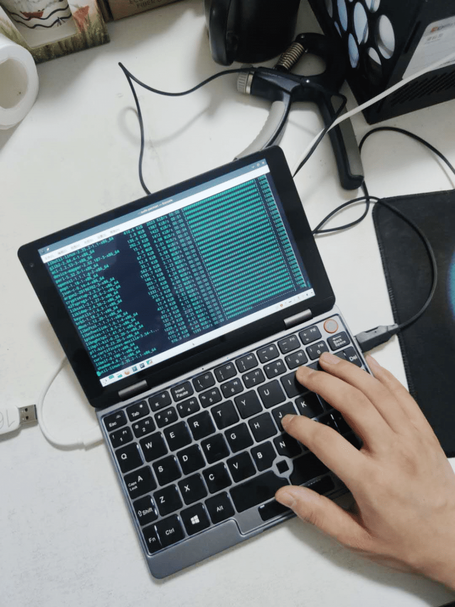
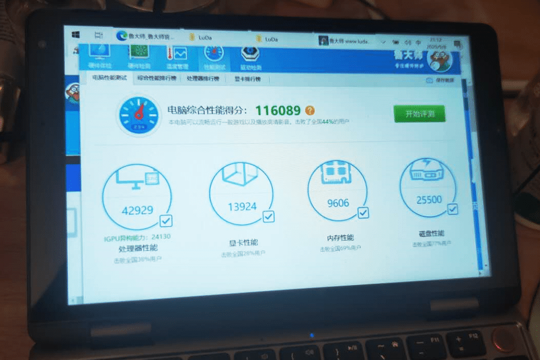
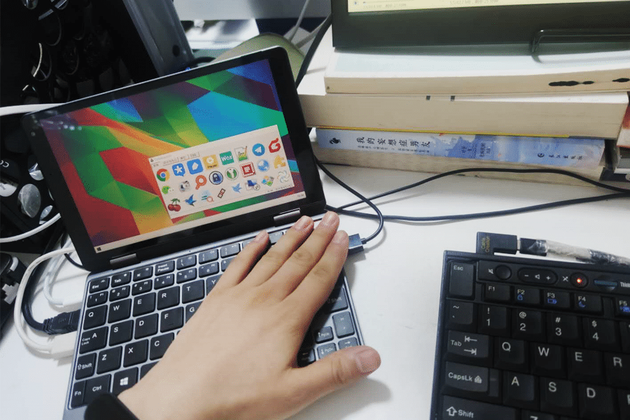

我对迷你笔记本电脑总是有着莫名的执着，前后买过GPD、壹号本、神奇小本等机器。
购入驰为MiniBook，主要是看上了性价比，M3-8100Y+16G的配置，别家都得四千多，驰为的两三千就能拿下。
使用了一阵子，简单说说体验。
<!--more-->
首先表扬键盘，按键敲击的段落感很明显，键粒大，有笔记本的感觉。
接下来，吐槽键盘：键位设计脑残，非标注的WASD按键，太往偏左了，导致每次想打A时，都敲成了S，总之，左边那一排的位置都很别扭，用了很久都还是不习惯，这样也就导致在很长一段时间内，不能盲打。

性能的话，鲁大师跑了一下，十万分出头，这个成绩差不多相当于x250（i5-5200U）的跑分，日常办公肯定是够了，但狂飙起来，风扇声音也很大，散热比GPD P2 MAX要好，后者跑起来，基本就不能摸，能把手烫成猪蹄。我使用Linux，装Manjaro的话，触摸屏没有驱动（我看网上有人搞定了），其它都正常，正常使用的话大概五六个小时。接口左右两个USB-A口，一个接扩展坞，一个备用，还行。
使用TypeC充电，好评，标配45W充电器，不过我没用过它那个充电器。
顺便吐槽一下这机器的MiniHDMI借口，你说你做到这种厚度了（比普通笔记本还厚），为啥不用标准HDMI口？导致每次出门还得带一根转接线，有点不便。

日常上班时是这样的，外接显示器打开干活，下班了直接合起来，塞手提袋里回家，还是比较惬意的。