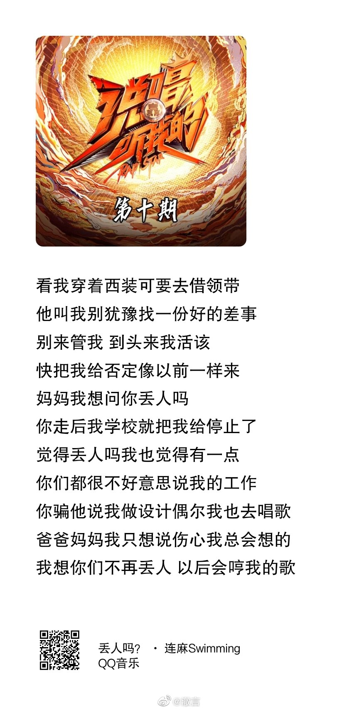

上月提报了一个“霸总题材”的甜宠网剧项目，不多久，广电审核老师找来，说觉得剧 名中的“霸总”二字不能用，建议改。 我不解，“霸总”又不是敏感词，为啥不能用？ 审核老师说，是不敏感，但不宜体现，能改就改吧，不然我提交到总局，回头人再驳 回来，耽误的还是大家的时间……我还有可能被批评。 所以，现在你应该能明白，为啥综艺节目的歌词总是被改的乱七八糟了吧。 因为没人知道红线在哪里（连审核的老师都不能完全知晓，只能尽量领会）。 所以大家只能“尽量少犯错”，不给彼此“添麻烦”。 理解万岁吧！

