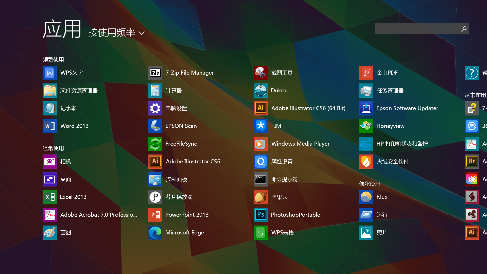

![Snipaste_2020-08-28_19-48-39.png][1]

<!--more-->戴尔5285，i7-7600U，16g内存，256G硬盘，二合一的本子。
相较于 Surface 系列，它的优势是拥有两个 TypeC 接口，外加一个标准的 TypeA 口。这个本子用很多年了，喜欢它的原因是轻，不加键盘800克，加键盘也就1公斤出头，平时都放公司当台式机用，但可能是拆机换硬盘，导致我手贱划伤了屏线接口，最近电脑产生了几个很奇怪的问题：- 触屏无效
- 在最低亮度下底部会漏光
- Win10 系统下，如果不插USB的话，就会卡屏，就是机器还在运行，声音啥的都正常，但屏幕就不会动了，能听到微信的提示声音，证明它还在运转，怪异。本来想装回 Manjaro 的，但这机器装 Linux 也有个问题，就是磁吸接口的键盘，一旦拽下来，再插上就没反映了，严重影响使用。后来折腾一圈，发现 Win8 下就不会卡屏，而且运转也很流畅，神奇。
安装方法跟平常系统一样，只不过装完后要到戴尔官网，下载它那个极其难用的驱动助理。
然后把剩余的驱动装上即可。
我使用的是 
很干净，但该有的补丁也都有，.Net库也装了，如果你也想在电脑上使用Win8，强烈推荐。
[下载地址][3]
  [1]: ../assets/2019/09/2342385936.png
  [2]: ../assets/2019/09/11038089.jpg
  [3]: http://bbs.pcbeta.com/forum.php?mod=viewthread&tid=1808880