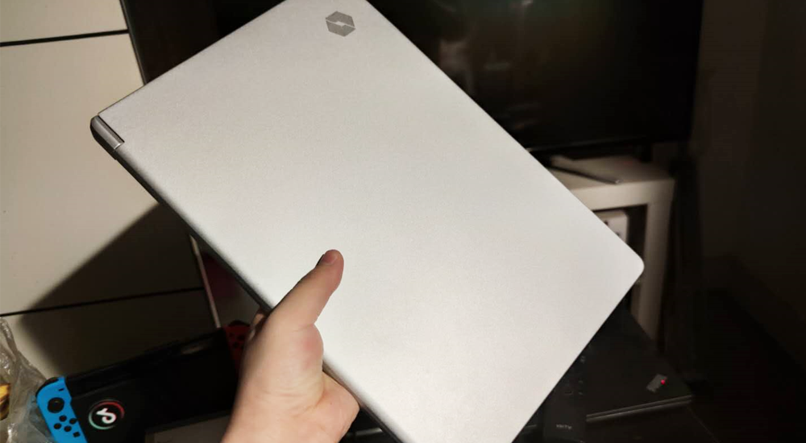
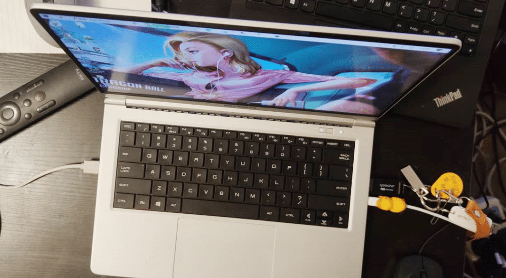

<!--more-->
第一感觉，这机器真轻啊，称了一下，1.1kg，要知道，12.5吋的X280都1.3kg了。何况这还是14吋，标压，双风扇，双内存插槽的机器。锐龙R7 8核16线程，性能极其强大，鲁大师跑分38万左右，剪视频打游戏完全没问题。平时使用非常安静，散热也满意，除了在渲染视频时，平时基本感觉不到风扇在运转。
原配的是DC充电器，非常大，好在机器支持 TypeC 充电，但传统的65W电源喂不饱，换了一个90W的，还是勉强，充电的时候会断断续续，但盒盖充电就很快。如果规定说我只能有一台笔记本电脑的话，那我一定选它。