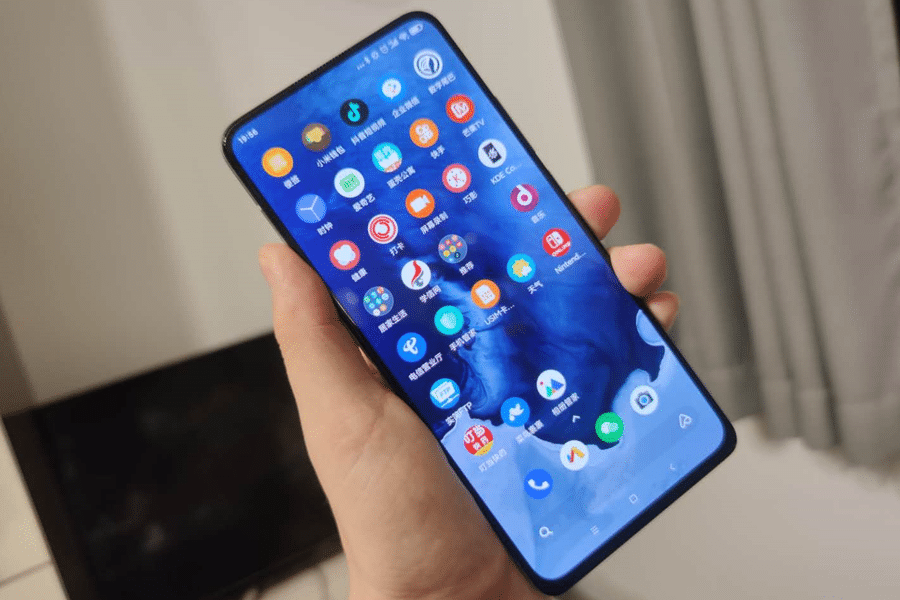
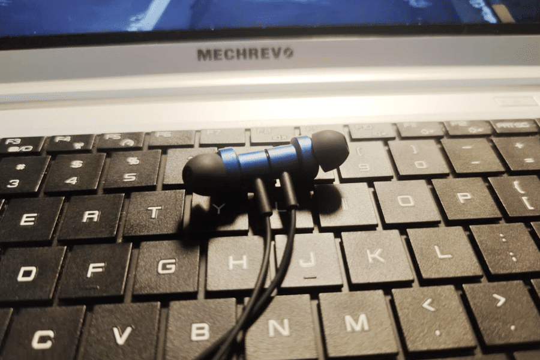

<!--more-->一直以来，使用的主力机都是小米CC系列，这也是迄今为止，我最满意的手机。原因说起来也简单：
拍照好看，媳妇喜欢。后来顺其自然地升级了CC9Pro，升级原因是5200毫安的大电池。因为我真的很烦出门带充电宝，而我又是标准的低电量会死星人，但现在出门移动支付、地铁、微信，哪一个都离不开手机。所以，我对手机只有两个要求：拍照好（因为懒得用相机），续航久（不想带充电宝）。
但CC9系列一直有个缺点，就是内存太小，我现在用的8+256，光一个微信就占用60G了。
换个更大内存的手机，于是就入了K30 512G尊享版。

使用几天下来，简单谈谈感受： - 机身太宽了，握持感不好，也可能是我习惯了小米CC9那个大曲面的关系。拿着K30，总感觉它不贴手；
 - 电池不禁用。本来120的刷新率就耗电，电池还只有4500多，实际使用下来，感觉它的续航只有CC9的一半多一点；    
 - 弹出式的前摄像头看着挺黑科技的，但总感觉它似乎很脆弱的样子； 拍照效果一般，无论前后摄像头，效果都明显不如CC9，尤其是夜景，黑乎乎的；
 - 性能我没什么感觉，我不怎么玩游戏，也不跑分，对我来说手机就是上上网拍拍照，用什么处理器都无所谓。
 - 联发科的处理器，没觉得有啥问题，就如同我对CC的一亿像素没感觉一样，我就是传说的实用党。最后，大内存就是爽啊……求CC的下一代出512G的。
顺便说一下，抢K30送的这个耳机是真的好，音质太棒了。
