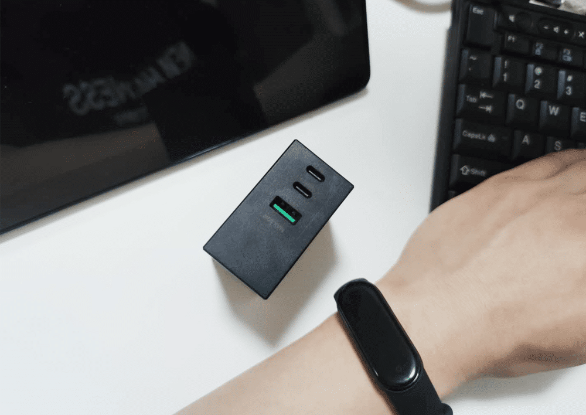

<!--more-->
最近主力机用机械革命S2 AIR，它搭载了 R7 4800H 的标压处理器，所以我现在用的 65W 的氮化镓充电器，充起来似乎有点吃力，就换了闪极的这个 90W，本来打算买网上另一款牌子的 120W 的充电器，后来想想，似乎没机会用到那么大功率，闪极这个还便宜。这个充电器给我的感觉就是：漂亮。十分方正，极其有设计感，而且很小巧，重量的话没有测，估计二三百克，属于能接受的程度。两个 C 口，一个 A 口，充电充手机都刚刚好。