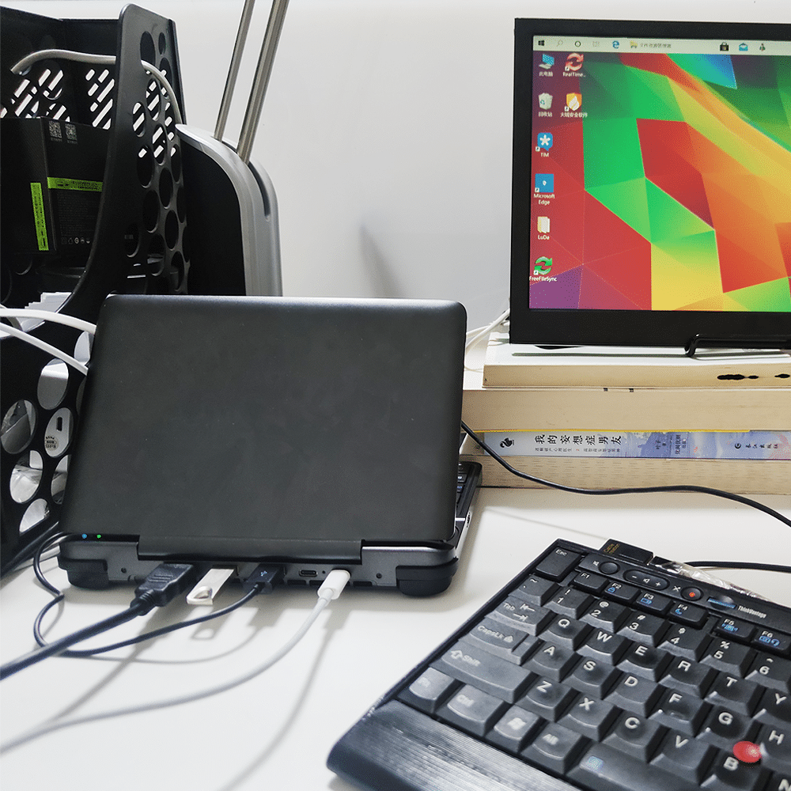
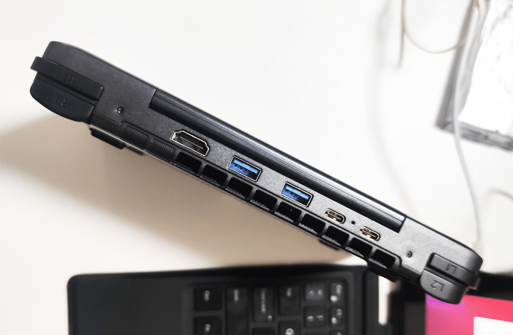
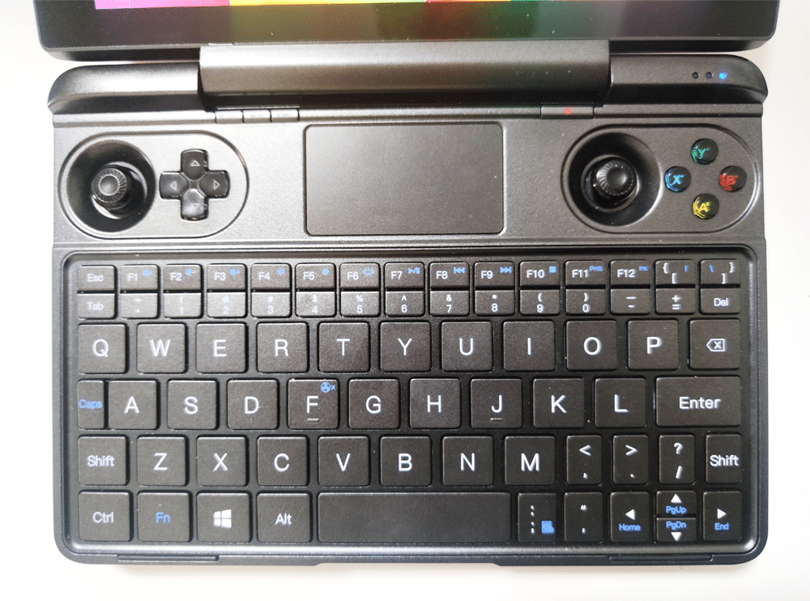

<!--more-->
时至今日，还能记得当初看到 GPD P2 MAX 的那种惊喜感：惊讶竟然有笔记本能做到这种尺寸，600多克的重量，轻巧的体积，极佳的便携程度，但入了之后就是无尽的失望和空虚。当时不满的有几个地方，其一是散热，风扇声音太大、太吵；其一是接口，使用的竟然是 Mini HDMI。而现在好了，GPD WIN MAX 把这几个地方都改善了。
老实讲，GPD WIN MAX 的散热已经和一般笔记本差不多了，绝对不会出现像以前那种，随便开个网页就风扇起飞的状况。
而且，两个 TypeC 口（其中一个，还是雷电口，能外接显卡），两个 USB-A，一个标准 HDMI 接口，这种设置太完美了，满意。但是，键盘的问题依旧，而且应该说是——比 P2 MAX 还要恶心！
首先就是键程，P2 的键程已经够短了，WIN MAX 竟然比它还短，如果说 P2 的按键是在敲桌子的话，那 WIN MAX 基本就跟敲空气差不多了，完全感受不到键程的存在，要知道，在打字的时候，键盘的键程越长，回弹越大，你手越不容易感觉到疲倦，所以 WIN MAX 这块让我很失望。
更失望的是这个键位设置，依然是非标准的 WASD，这种恶心的键位排列，相较于 P2 MAX 来说，是一种退化。至于游戏，我买它就是用来办公的，所以，游戏体验——不知道。最后，说说重量，单机840克，这个重量已经不算轻了，如果是看着便携性，倒不如买 LG Gram，也是800多克，但那个有13吋屏和正常的全尺寸键盘。