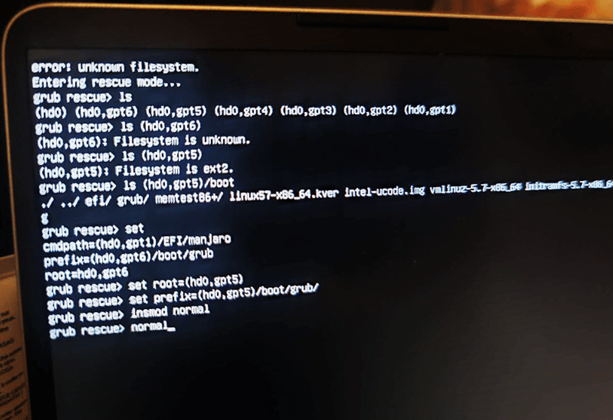

<!--more-->Windows 和 Linux 双系统的话，一般会由 Linux 的 Grub 来引导，但 Windows 更新偶尔会使 Grub 引导损坏，例如 Win10 的 2004 版本会创建一个新的恢复分区，导致 Grub 记录的分区数后移，开机显示 Grub Rescue，无法正确索引，黑屏画面如下：
所以，我们只需要把 Grub 的设置，指定到正确的那个 Linux 分区下就可以了。
方法如下：    ls
使用 ls 把全部的系统磁盘列出来，然后挨个查看，看那个磁盘下有 boot/grub 文件
你像我图上，ls 之后，显示     (hd0) (hd0,gpt6) (hd0,gpt5) (hd0,gpt4) (hd0,gpt3) (hd0,gpt2) (hd0,gpt1)
我先盲猜一下 (hd0,gpt6) 这个盘，于是：    ls (hd0,gpt6) 
它显示 Filesystem is unknowm，即是说：这个盘并不是一个 Linux 分区，那就不是它了，那我们继续往下找，直到它显示    Filesystem is ext2
说明这个盘是 Linux 分区，我的是在 (hd0,gpt5) 然后，再看看它里面有没有启动文件：    ls (hd0,gpt6)/boot/

它返回了正确的文件列表，说明就是这个盘，那之后，我们把 Grub 的参数设置为这个盘，就可以启动了。先 set 一下，输出当前的设置看看：    set #输出当前设置
可以看到，Grub 现在记录的是(hd0,gpt1)这个盘，所以，我们应该把它改为正确的(hd0,gpt5)    set root=(hd0,gpt5)
    set prefix=(hd0,gpt5)/boot/grub/
    insmod normal
    normal
当敲完最后一个 normal 后，就会显示 Grub 的引导画面了，如下：
选择 Manjaro Linux，即可正常进入系统，但进入系统后，别急，还得重新装一下 Grub，不然下次重启，你还得再操作一次上面的流程。进入系统后，打开终端，先更新下引导：    sudo update-grub看一下你的硬盘号：    sudo fdisk -l我这里是 /dev/nvme0n1，于是：    sudo grub-install /dev/nvme0n1再重启，Grub 引导就恢复正常了。
![2020-09-21 23-00-15屏幕截图.png][1]
  [1]: ../assets/2020/09/796716740.png