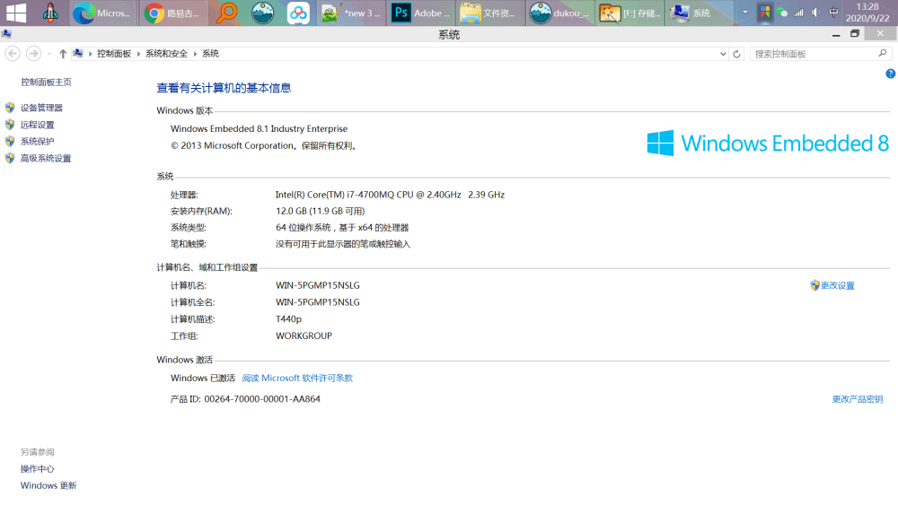

起因是在家里翻出一堆闲置硬盘
而存储告急，如果弄成移动硬盘，不太好归档，又容易丢
考虑到在公司用电脑，对配置没要求
一般办公用
最好是能把这些盘塞到一台电脑里
我又不喜欢台式机
做为一个垃圾佬，要找到最合适的设备
发挥垃圾佬的本领，刚好又翻出一台 ThinkPad T440P
为什么这台机器，因为
它是 ThinkPad 最后一台能换 CPU 的笔记本
最高可以换到 i7-4700MQ 
同时，它支持一个 ngff2242的硬盘，一个 SATA的笔记本硬盘，把光驱拆掉，还能再塞一块盘
刚好满足我的需求

价格，在闲鱼上收台i5的低配空机，也就900多块钱，4700MQ的处理器大概三四百块钱目前配置为
i7-4700MQ+12G内存+512ngff+1Tsata+512光驱位硬盘ThinkPad T440P + i7 4700MQ 999
光驱支架 6.46块钱（购于拼多多）
英特尔7260AC 双频5G 网卡  27.58
因为主要放公司，外接显示器用
所以就没有改三键触摸板和屏幕整个价格才1000出头，还是很有性价比的。
鲁大师跑了下分，10万出头，还可以。