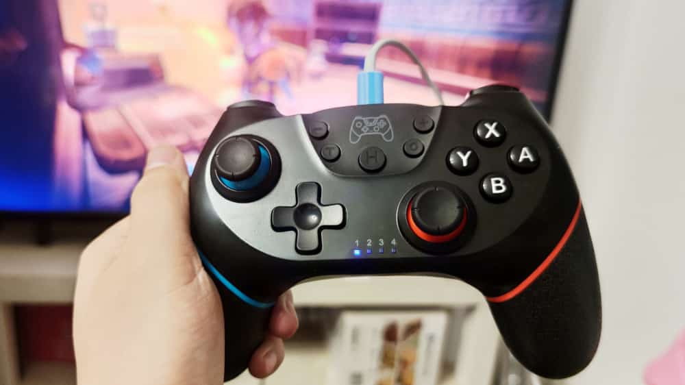

<!--more-->刚开始链接的时候有点慢，机器搜索了好久，但等连上就好了。不过手柄休眠后，再唤醒时，连接也有点慢。好在电池还比较耐用，刘小姐玩了两个多小时的塞尔达，还有电。最不爽的地方，这玩意充电时，下面的指示灯总是会闪，对着眼睛闪的那种，神烦，剪了块绝缘胶带给贴住了。
其它功能都有，震动反馈很强烈，陀螺仪精准，连接稳定，这个价位没啥可挑剔的了。
最后，大师模式的塞尔达还是很香，青春啊。
