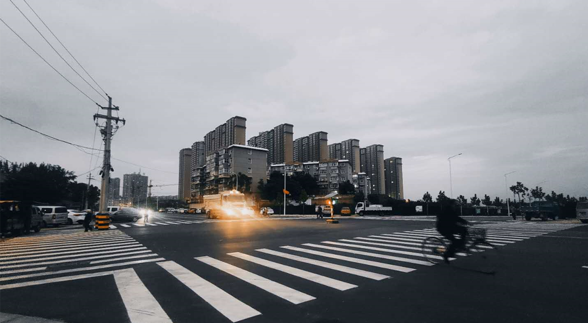
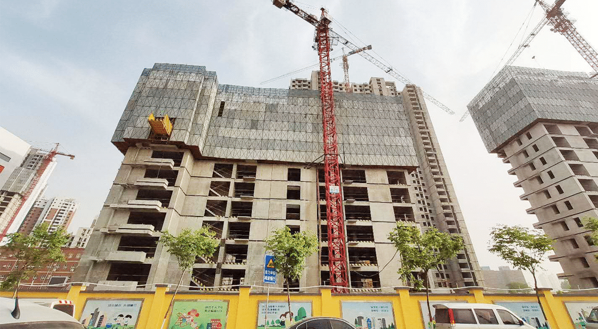
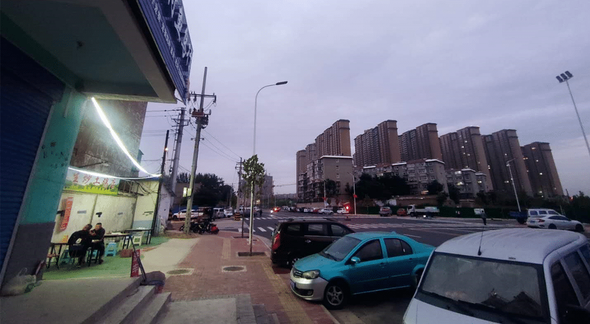
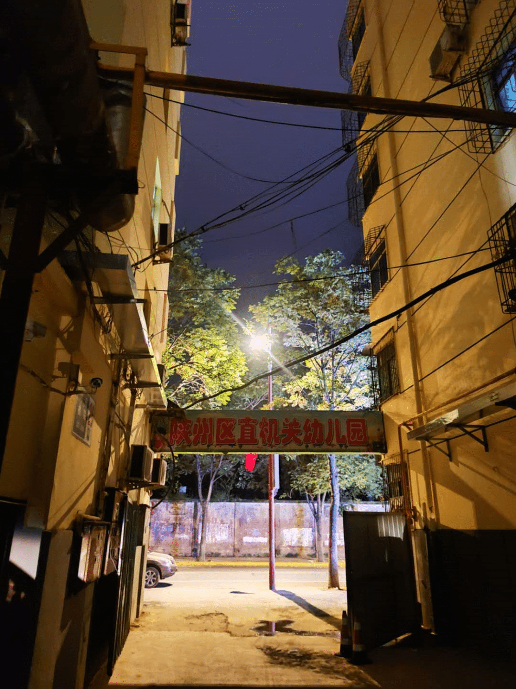

<!--more-->到了该面对这些问题的时候了。三十而立，总不能一直飘着，其实飘着也没什么不好，在外面有奋斗的动力，不像在家里这样慵懒。但毕竟结婚了，得给老婆一个交代，好点的是，刘小姐年纪还小，才25岁，对未来不那么着急，多少给我留了点缓冲的空间。多亏《王牌创业者》的影视版权卖出去了，手里能有点钱，2019年5月时，通过朋友推荐，在郑州买了套房，估计明年后能交，到时看情况是搁置还是出租——因为我估计，我还会在北京呆上四五年。买房这事现在回想起来，多少还是有点犹豫，毕竟“在北京还是去郑州”，仍是我没想清楚的问题。
北京的话，或许努努力东拼西凑，整一两百万，能买个三四十平的小房子，但一想到生养小孩，就浑身打颤，通勤和学费都让人头疼。相较而言，郑州好一些，房子楼下就是小学，500米是郑州第十一中学，至少接送都没问题。

郑州买的房子，在北三环。不过，要是我35岁生孩子，孩子12岁上中学，那我就快五十岁了——鬼知道四五十岁时的我，又会是什么样子呢？
而我五十岁，我爸妈就七十了，这就面临另一个问题：养老。
今年回家，发现我爸的头发几乎已经白光了，我妈脸上也全是皱纹了，五十出头的人，为生活操劳得厉害。奶奶今年年初过世了，她之后，家里最大的就是大伯了，长兄为父，他也老的不行。
所以，郑州另一个好处就是离家近，动车一小时，票价70块钱，开车两三个小时——两三个小时，这点时间还不够北京绕一圈吧？这样讲来，以后家里有点事，照顾起来方便，甚至可以当天来当天回，效率会高一些。
其实最想去的还是西安，西安地方好，感觉西安更发达一点，但是朋友少，在郑州至少还有几个熟悉的朋友，以后没事出来还能聚聚，而西安的话，能想到的人真是屈指可数。我今年31了，到40岁还有9年，到50岁还有19年。
那么，9年前我在做什么，那时我22岁，在北京上了两三年班了，每天对未来极度迷茫，之后24岁，跟小伙伴们创业，那时的创业是个笑话，没有规划没有方向，啥都没有，闹着玩一样，所以很快倒闭。那些年也没有存款，身上的钱最多时，也就一两万。
这么一回顾，才发现钱不是攒出来的，还是得来笔大的，但这就又面临第三个问题：生存。代码肯定是写不动了，设计也没别人干得好，现在转行写书，又他妈是个夕阳产业，真不清楚回去还能干啥，随便找个班上又不太甘心……算了，不想了，还是乖乖写小说去吧，没准再能卖个电影版权呢？

