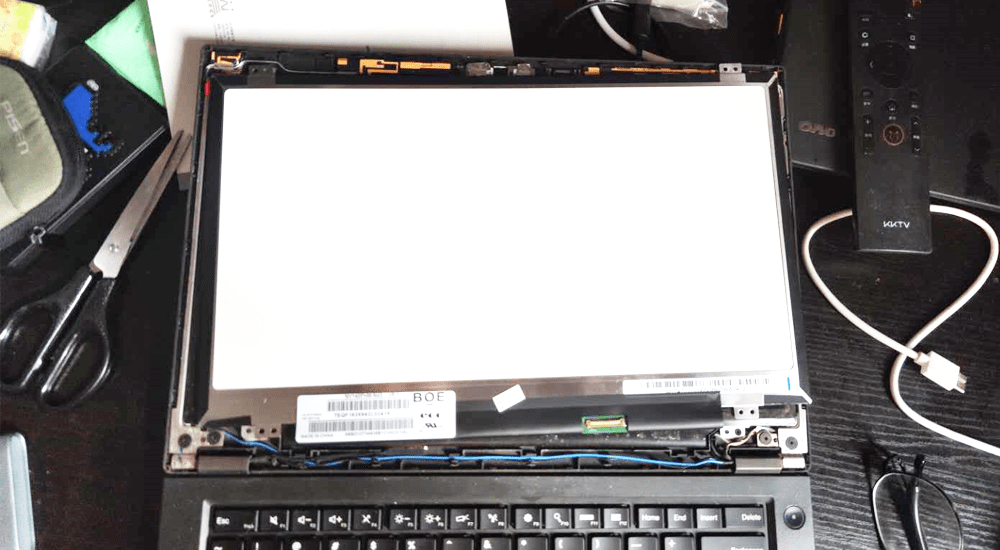
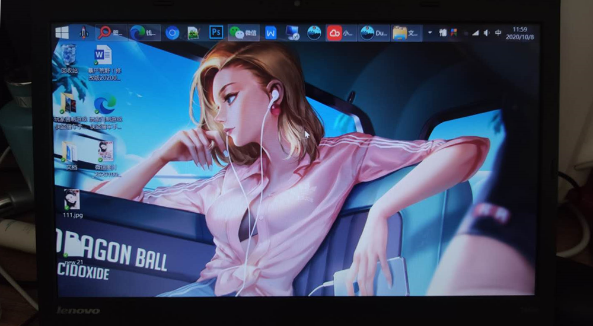

<!--more-->
据我所知，T440P 应该是最后一款可更换 CPU 的 ThinkPad，我手上的这台是500块钱从闲鱼上收的空机，之后我自己换了 i7-4700MQ，性能够用，但就是这个 TN 屏幕太渣，从淘宝上240买了块 IPS 1080P，世界焕然一新了。

原来的TN屏，简直辣眼。

新的IPS屏，型号 *京东方液晶模组 NV140FHM-N43*，非PWM调光，没有屏闪。这个机器换屏很简单，暴力抠开B壳，然后拆下四个螺丝，抠掉屏线，换上新屏即可，没啥技术含量。
且原生支持亮度调节。