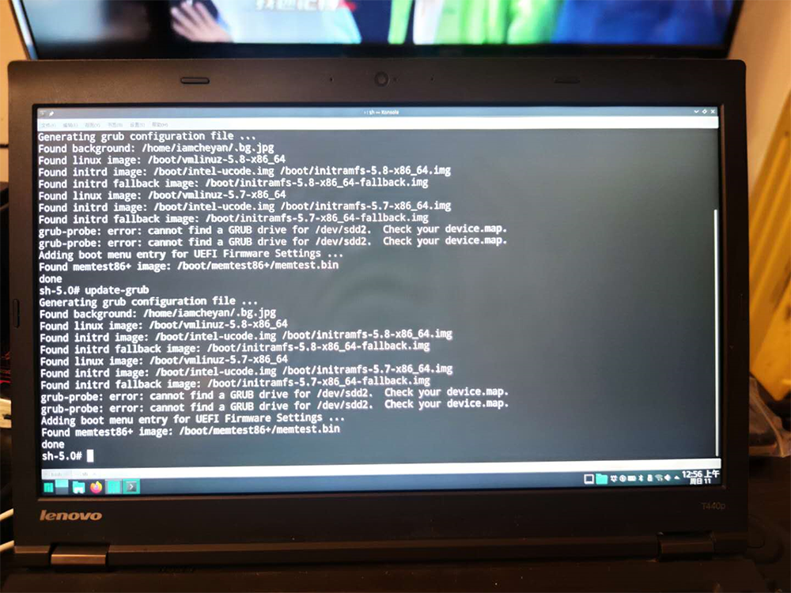

Modified: 2020-10-11

Category:技术相关
手贱搞坏了硬盘分区表，导致EFI分区消失，Windows 重建EFI分区的方法满大街都是，随便找个PE就可以，但 Manjaro 稍微费点功夫，特此记录。

<!--more-->
以下需要 Root 权限，sudo -i 或命令前加 sudo。
注意，Manjaro Live 系统的管理员密码是 *manjaro*（全小写）。先用 Manjaro 安装优盘进入 LIVE 环境，然后查看要引导系统的分区和efi分区的编号    sudo fdisk -l找到你的系统所在分区，和 EFI 分区挂载引导系统的分区    sudo mount /dev/sda2 /mnt挂载 EFI 分区到系统分区的 /boot/ef i目录    sudo mount /dev/sda1 /mnt/boot/efichroot到硬盘系统分区    manjaro-chroot /mnt安装grub    grub-install --target=x86_64-efi /dev/sda1  #target 默认是x86_64-efi
    grub-grub-mkconfig -o /boot/grub/grub.cfg
    update-grub