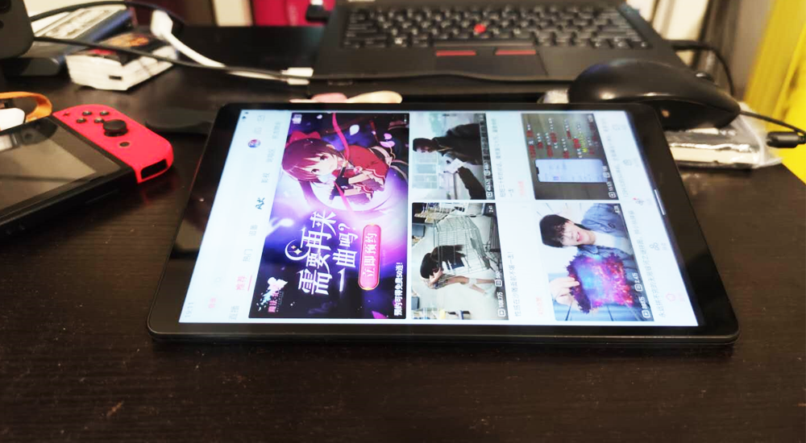
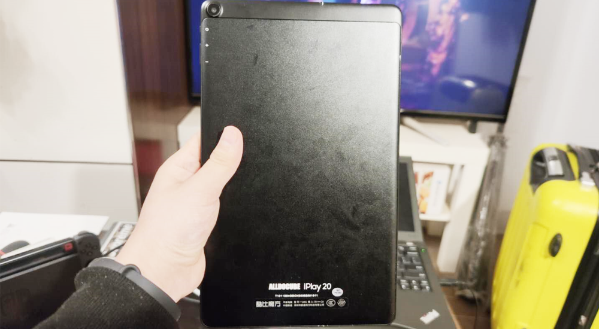

<!--more-->国庆在家总抱着手机，突然就萌生了买个安卓平板的想法，挑了一圈，看到五百多块钱的苦逼魔方，搜了下评论，都说机器手感一般，但屏幕还不错，买回来到手，诚不欺我，这个屏确实不错，没有以前国产寨板的大灰屏观感，性能也还可以，反正我只用来刷刷B站，但这机器的手感实在太差了，修长修长，像加长版的手机，而安卓对平板的适配又糟糕到极点，所有的应用都是竖屏的，但看视频又得横过来，导致来回切换屏幕方向， 十分无语。还有就是，这个机器的后壳，太丑。
